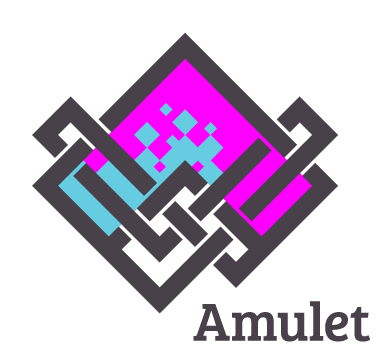

<p align="center"></p>
 
Amulet is a Lua-based audio/visual toolkit designed for small games and experimentation.

Here's what a minimal Hello World! looks like in Amulet:

```lua
am.window{}.scene = am.text("Hello World!")
```

## Supported platforms

It currently runs on the following platforms:

- Windows 7+
- Mac OS X
- Linux
- iOS
- Android
- HTML5

## Binary distributions

These are available from <http://www.amulet.xyz>.

## Documentation

See <http://www.amulet.xyz/doc/>.

## Reporting bugs or requesting features

I don't use the github issue tracker. Instead please email bug reports
or feature requests to me at ian -at- ianmaclarty.com, or use the
<a href="https://groups.google.com/forum/#!forum/amulet-forum">forum</a>.

## Building from source

### Linux

Make sure you have gcc and g++ installed, then do:

```
make
```

If you get errors, you may also need to install additional dev packages,
such as as libgl1-mesa-dev (for OpenGL headers) or libasound2-dev
(for audio support in SDL).

### OSX

Install the command line developer tools (clang, clang++), then do:

```
make
```

### Windows

You will need to install [MinGW and MSYS](http://www.mingw.org/)
as well as a Microsoft Visual C compiler.

You will need to create your own version of msys.bat with something
like the following at the top:

```
call "%VS120COMNTOOLS%vsvars32.bat" >NUL:
```

(VS120COMNTOOLS may be different depending on which version
of Visual Studio you're using.)

This sets up the Visual Studio command line environment.

Then, from the msys shell, do:

```
make
```

### Cross compiling

It's also possible to cross-compile to various platforms (e.g. HTML5, iOS, MinGW).
See the files .travis.yml, scripts/appveyor.bat and scripts/travis.sh for
examples of how to do this.

## Credits

Amulet uses or borrows code and ideas from the following projects:

- [Lua](http://www.lua.org/)
- [LuaJIT](http://luajit.org/)
- [SDL2](https://www.libsdl.org)
- [Sean's Tool Box](https://github.com/nothings/stb)
- [KissFFT](http://sourceforge.net/projects/kissfft/)
- [Blink](http://www.chromium.org/blink)
- [ANGLE](https://github.com/google/angle)
- [FreeType](http://www.freetype.org/)
- [GLM](https://github.com/g-truc/glm)
- [Emscripten](http://emscripten.org)
- [OpenCV](http://opencv.org/)
- [SimpleGlob](https://github.com/brofield/simpleopt)
- [TinyMT](https://github.com/MersenneTwister-Lab/TinyMT)
- [sfxr](http://www.drpetter.se/project_sfxr.html)
- [glsl-optimizer](https://github.com/aras-p/glsl-optimizer)

The HTML editor uses code and ideas from:

- [Codemirror](https://codemirror.net/)
- [PuzzleScript](https://github.com/increpare/PuzzleScript) and [Zeedonk](https://github.com/TerryCavanagh/zeedonk)
- [jQuery](https://jquery.com/)
- [JSZip](https://stuk.github.io/jszip/)
- [FileSaver.js](https://github.com/eligrey/FileSaver.js/)

The Amulet logo was designed by [Bethany Wilksch](http://www.plumb-bob.com.au).

## Build status

| System |  Status |
|:-------------|:------------|
|Travis (Linux, OSX, iOS, MinGW, Android, HTML) | [](https://travis-ci.org/ianmaclarty/amulet) |
|Appveyor (MSVC) | [](https://ci.appveyor.com/project/ianmaclarty/amulet) |
