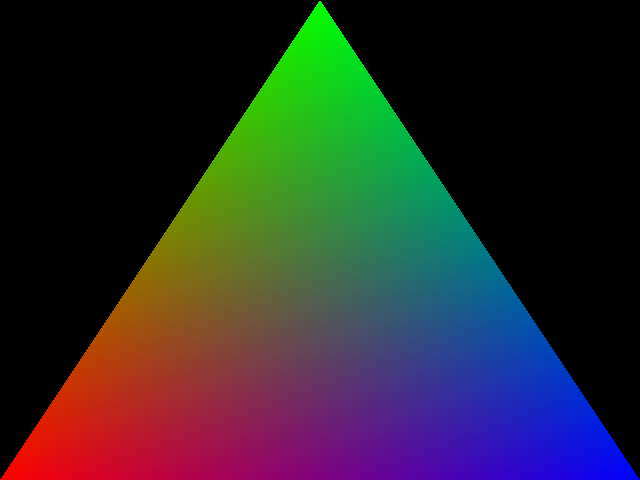

Graphics
========

Overview
--------

This section goes into detail about Amulets low-level graphics features.
Some knowledge of how shaders and the modern graphics pipeline work is
recommended before reading this section. If you're just interested in
drawing simple sprites and shapes then you can probably skip this
section, but if you're interested in experimenting with shaders and 3D
rendering then read on.

Creating a window
-----------------

To create a window use the `am.window` function. This function accepts a
table of window settings, all of which are optional. (For a full list of
settings see am.window in the API reference.)

Here's how to create a 800x600 window:

``` {.sourceCode .lua}
local win = am.window{
    title = "My Window",
    width = 800,
    height = 600,
}
```

The `width` and `height` settings are just hints to the operating
system. It may create a bigger or smaller window.

Once a window is created you can obtain its actual pixel dimensions
using the `width` and `height` fields of the window object. Don't assume
these will be the same as the width and height you requested when
creating the window.

Also don't expect these values to remain constant, even if you request a
fullscreen window. On some platforms the operating system will perform
an animation when transitioning to fullscreen mode and the width and
height fields will only be updated once the animation has finished.

The window:resized method can be used to detect if a window's size
changed since the last frame.

To close a window call its window:close method. This also quits the
application if there was only one window open.

Note: while it's possible to create multiple windows, this isn't
recommended at the moment.

Shaders
-------

Scene graphs
------------

In Amulet, all drawing is done by building a *scene graph* that is then
rendered to a window or offscreen framebuffer. Each node in the scene
graph either configures some part of the graphics system (for example
setting the blend mode or shader program), or draws some graphics
primitives, such as triangles or lines.

Here is an example scene graph that draws a colored triangle:

This scene graph has 3 nodes:

1.  The root node, `am.use_program`, sets up the shader program to use
    for subsequent rendering. Here we use the built-in shader program
    `am.shaders.colors2d` which is a simple shader that renders 2D
    vertices with a separate color per vertex.
2.  The `am.bind` node binds values to the shader's uniforms and
    attributes -- it supplies data to the shader. The
    `am.shaders.colors2d` shader expects perspective and modelview
    matrix uniforms called `P` and `MV` respectively. We bind these to
    the identity matrices. It expects a vec4 attribute called `color`
    which we bind to an array of 3 colors (red, green and blue). The
    shader also expects a vec2 attribute called `vert`. We bind this to
    a vec2 array containing 3 vertices: (-1, -1), (1, -1) and (0, 1).
    Since we're using the identity perspective and modelview matrices
    these will correspond to the bottom left, bottom right and top
    middle points of the window we're drawing to.
3.  Finally the `am.draw` node draws triangle primitives using the
    previously set up shader and data.

The produced image looks like this:



And here's what the corresponding code looks like:

``` {.sourceCode .lua}
am.window{}.root =
    am.use_program(am.shaders.colors2d)
    ^ am.bind{
        P = mat4(1),
        MV = mat4(1),
        color = am.vec4_array{vec4(1, 0, 0, 1), vec4(0, 1, 0, 1), vec4(0, 0, 1, 1)},
        vert = am.vec2_array{vec2(-1, -1), vec2(0, 1), vec2(1, -1)}
    }
    ^ am.draw("triangles")
```

Binding shader inputs
---------------------

Drawing primitives
------------------

Transforms
----------

Textures
--------

Framebuffers
------------

Graphics API reference
----------------------
