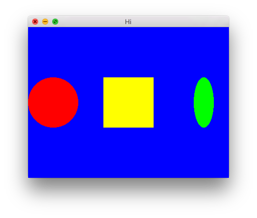

Quickstart tutorial {#quickstart}
===================

Install Amulet
--------------

### Windows

[Download](http://www.amulet.xyz) the Windows installer and run it.
Or, if you prefer, download the Windows zip archive,
extract it to a directory of your choice and add that folder
to your PATH.

### Mac

[Download](http://www.amulet.xyz) and extract the Mac zip archive to a
directory of your choice. Then add the directory to your PATH.

### Linux

[Download](http://www.amulet.xyz) and extract the Linux zip archive to a
directory of your choice. Then add the directory to your PATH.
The `amulet` executable is for x86_64. If you're running a 32 bit system,
rename the file `amulet.i686` to `amulet`.

Run a script
------------

Create a text file called `main.lua` containing the following:

~~~ {.lua}
log("It works!")
~~~

Open a terminal ("command prompt" on Windows) and change to the directory
containing the file. Then type "`amulet main.lua`":

~~~ {.console}
> amulet main.lua
main.lua:1: It works!
~~~

If you see the text "`main.lua:1: It works!`", Amulet is installed and
working.

Create a window
---------------

Type the following into `main.lua`:

~~~ {.lua}
local win = am.window{
    title = "Hi",
    width = 400,
    height = 300,
    clear_color = vec4(1, 0, 0.5, 1)
}
~~~

and run it as before. This time a bright pink window should appear.

Render some text
----------------

Add the following line to main.lua after the line that creates the
window:

~~~ {.lua}
win.scene = am.text("Hello!")
~~~

This assigns a *scene graph* to the window. The scene has a single
text node. The window will render its scene graph each frame.

Transform the text
------------------

Change the previous line to:

~~~ {.lua}
win.scene = 
    am.translate(150, 100)
    ^ am.scale(2)
    ^ am.rotate(math.rad(90))
    ^ am.text("Hello!")
~~~

This adds translate, scale and rotate nodes as parents of the text node.
These nodes transform the position, size and rotation of all their
children. The resulting scene graph looks like this:

The translate node moves its descendents to the right 150 and up 100 (by
convention the y axis increases in upward direction). The scale node
doubles its descendents's size and the rotate node rotates its descendents by
90 degrees (`math.rad` converts degrees to radians).
Finally the text node renders some text to the screen.

When you run the program you should see something like this:

Animate!
--------

Add the following to the end of main.lua:

~~~ {.lua}
win.scene:action(function(scene)
    scene"rotate".angle = am.frame_time * 4
end)
~~~

When you run it the text will spin.

This code adds an *action* to the scene, which is a function that's run
once per frame. Actions can be added to any scene node. In this
case we've added it to the node `win.scene`, which is the top
`translate` node of our scene graph. The node to which an action
is attached is passed as an argument to the action function.

The line:

~~~ {.lua}
scene"rotate".angle = am.frame_time * 4
~~~

first finds a node with the *tag* `"rotate"` in the scene graph.
By default nodes have tags that correspond to their names, so
this returns the rotate node. You can also add your own tags
to nodes using the `tag` method.

Then we set the `angle` property
of the rotate node to the current frame time (the time at the
beginning of the frame, in seconds) times 4.

Since this code is run each frame, it causes the text to spin.

Here is the complete code listing:

~~~ {.lua}
local win = am.window{
    title = "Hi",
    width = 400,
    height = 300,
    clear_color = vec4(1, 0, 0.5, 1)
}
win.scene = 
    am.translate(150, 100)
    ^ am.scale(2)
    ^ am.rotate(math.rad(90))
    ^ am.text("Hello!")
win.scene:action(function(scene)
    scene"rotate".angle = am.frame_time * 4
end)
~~~

Draw some shapes
----------------

Here is a simple program that draws a red circle,
a yellow square and a green ellipse on a blue background:

~~~ {.lua}
local red = vec4(1, 0, 0, 1)
local green = vec4(0, 1, 0, 1)
local blue = vec4(0, 0, 1, 1)
local yellow = vec4(1, 1, 0, 1)

local win = am.window{
    title = "Hi",
    width = 400,
    height = 300,
    clear_color = blue,
}

win.scene =
    am.group()
    ^ {
        am.translate(-150, 0)
        ^ am.circle(vec2(0, 0), 50, red)
        ,
        am.translate(0, 0)
        ^ am.rect(-50, -50, 50, 50, yellow)
        ,
        am.translate(150, 0)
        ^ am.ellipse(vec2(0, 0), 20, 50, green)
    }
~~~

This time, we've created variables for the different
colours we'll need. In Amulet colours are 4-dimensional
vectors. Each component of the vector represents
the red, green, blue and alpha intensity of the colour
and ranges from 0 to 1.

The scene graph has a `group` node at the top. `group`
nodes don't have any effect on the rendering and are
only used to group other nodes together. The group
nodes has 3 children, each of which is a `translate`
node with a shape child. The scene graph looks like this:

Instead of building the scene graph using the `^` operator
as we've done above, we can also do it step-by-step using the
`append` method, which adds a node to the child list of another
node:

~~~ {.lua}
local circle_node = am.translate(-150, 0)
circle_node:append(am.circle(vec2(0, 0), 50, red))

local rect_node = am.translate(0, 0)
rect_node:append(am.rect(-50, -50, 50, 50, yellow))

local ellipse_node = am.translate(150, 0)
ellipse_node:append(am.ellipse(vec2(0, 0), 20, 50, green))

local group_node = am.group()
group_node:append(circle_node)
group_node:append(rect_node)
group_node:append(ellipse_node)

win.scene = group_node
~~~

This results in the exact same scene graph.

Respond to key presses
----------------------

Let's change the above program so that the 3 shapes only appear
if the A, B or C keys are being held down.

Add the following to the end of the program:

~~~ {.lua}
win.scene:action(function(scene)
    scene"circle".hidden = not win:key_down"a"
    scene"rect".hidden = not win:key_down"b"
    scene"ellipse".hidden = not win:key_down"c"
    if win:key_pressed"escape" then
        win:close()
    end
end)
~~~

The `hidden` field of a node determines whether it is drawn
or not. Each frame we set the `hidden` field of the
circle, rect and ellipse nodes to whether the
A, B or C keys are being pressed. `win:key_down(X)` 
returns true if key `X` was being held down at the start
of the frame.

We also check if the escape key was pressed and if
it was we close the window. `win:key_pressed(X)`
returns true if the key was pressed down before the
start of the current frame, but after the start of the
previous frame (i.e. it will only return true
in the frame immediately after the one in which the key was pressed).

You may notice that the three shapes appear briefly
when the window is first shown and then disappear
immediately. This is because actions only
start running in the next frame, so the shapes are only hidden
on the second frame. To fix this we can add the following
three lines either before or after we add the action
(it doesn't matter where):

~~~ {.lua}
win.scene"circle".hidden = true
win.scene"rect".hidden = true
win.scene"ellipse".hidden = true
~~~

The complete program is:

~~~ {.lua}
local red = vec4(1, 0, 0, 1)
local green = vec4(0, 1, 0, 1)
local blue = vec4(0, 0, 1, 1)
local yellow = vec4(1, 1, 0, 1)

local win = am.window{
    title = "Hi",
    width = 400,
    height = 300,
    clear_color = blue,
}

win.scene =
    am.group()
    ^ {
        am.translate(-150, 0)
        ^ am.circle(vec2(0, 0), 50, red)
        ,
        am.translate(0, 0)
        ^ am.rect(-50, -50, 50, 50, yellow)
        ,
        am.translate(150, 0)
        ^ am.ellipse(vec2(0, 0), 20, 50, green)
    }

win.scene:action(function(scene)
    scene"circle".hidden = not win:key_down"a"
    scene"rect".hidden = not win:key_down"b"
    scene"ellipse".hidden = not win:key_down"c"
    if win:key_pressed"escape" then
        win:close()
    end
end)

win.scene"circle".hidden = true
win.scene"rect".hidden = true
win.scene"ellipse".hidden = true
~~~

Draw images
-----------

Play sounds
-----------
