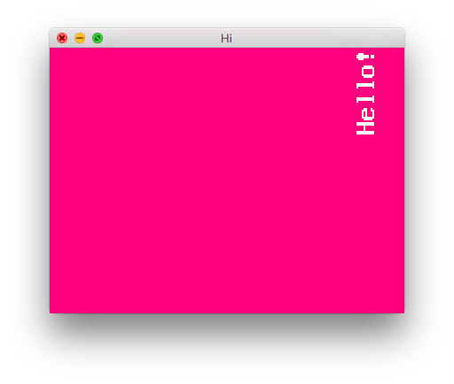
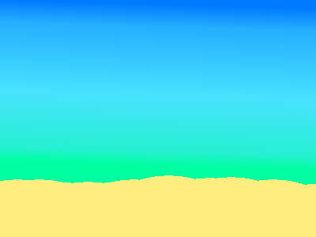
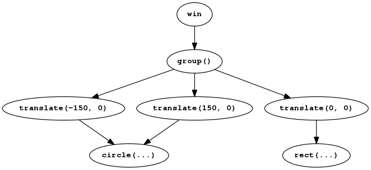

Quickstart tutorial {#quickstart}
===================

Install Amulet
--------------

**Windows:**

[Download](http://www.amulet.xyz) the Windows installer and run it.
Or, if you prefer, download the Windows zip archive,
extract it to a directory of your choice and add that folder
to your PATH.

**Mac:**

[Download](http://www.amulet.xyz) and extract the Mac zip archive to a
directory of your choice. Then add the directory to your PATH.

**Linux:**

[Download](http://www.amulet.xyz) and extract the Linux zip archive to a
directory of your choice. Then add the directory to your PATH.
The `amulet` executable is for x86_64. If you're running a 32 bit system,
rename the file `amulet.i686` to `amulet`.

Run a script
------------

Create a text file called `main.lua` containing the following:

~~~ {.lua}
log("It works!")
~~~

Open a terminal ("command prompt" on Windows) and change to the directory
containing the file. Then type "`amulet main.lua`":

~~~ {.console}
> amulet main.lua
main.lua:1: It works!
~~~

If you see the text "`main.lua:1: It works!`", Amulet is installed and
working.

Create a window
---------------

Type the following into `main.lua`:

~~~ {.lua}
local win = am.window{
    title = "Hi",
    width = 400,
    height = 300,
    clear_color = vec4(1, 0, 0.5, 1)
}
~~~

and run it as before. This time a bright pink window should appear.

Render some text
----------------

Add the following line to main.lua after the line that creates the
window:

~~~ {.lua}
win.scene = am.text("Hello!")
~~~

This assigns a *scene graph* to the window. The scene has a single
text node. The window will render its scene graph each frame.

Transform the text
------------------

Change the previous line to:

~~~ {.lua}
win.scene = 
    am.translate(150, 100)
    ^ am.scale(2)
    ^ am.rotate(math.rad(90))
    ^ am.text("Hello!")
~~~

This adds translate, scale and rotate nodes as parents of the text node.
These nodes transform the position, size and rotation of all their
children. The resulting scene graph looks like this:

The translate node moves its descendents to the right 150 and up 100 (by
convention the y axis increases in upward direction). The scale node
doubles its descendents's size and the rotate node rotates its descendents by
90 degrees (`math.rad` converts degrees to radians).
Finally the text node renders some text to the screen.

When you run the program you should see something like this:

Animate!
--------

Add the following to the end of main.lua:

~~~ {.lua}
win.scene:action(function(scene)
    scene"rotate".angle = am.frame_time * 4
end)
~~~

When you run it the text will spin.

This code adds an *action* to the scene, which is a function that's run
once per frame. Actions can be added to any scene node. In this
case we've added it to the node `win.scene`, which is the top
`translate` node of our scene graph. The node to which an action
is attached is passed as an argument to the action function.

The line:

~~~ {.lua}
scene"rotate".angle = am.frame_time * 4
~~~

first finds a node with the *tag* `"rotate"` in the scene graph.
By default nodes have tags that correspond to their names, so
this returns the rotate node. You can also add your own tags
to nodes using the `tag` method which we'll discuss in more detail
in the next section.

Then we set the `angle` property
of the rotate node to the current frame time (the time at the
beginning of the frame, in seconds) times 4.

Since this code is run each frame, it causes the text to spin.

Here is the complete code listing:

~~~ {.lua}
local win = am.window{
    title = "Hi",
    width = 400,
    height = 300,
    clear_color = vec4(1, 0, 0.5, 1)
}
win.scene = 
    am.translate(150, 100)
    ^ am.scale(2)
    ^ am.rotate(math.rad(90))
    ^ am.text("Hello!")
win.scene:action(function(scene)
    scene"rotate".angle = am.frame_time * 4
end)
~~~

Draw some shapes
----------------

Here is a simple program that draws 2 red circles
on either side of a yellow square on a blue background.

~~~ {.lua}
local red = vec4(1, 0, 0, 1)
local blue = vec4(0, 0, 1, 1)
local yellow = vec4(1, 1, 0, 1)

local win = am.window{
    title = "Hi",
    width = 400,
    height = 300,
    clear_color = blue,
}

win.scene =
    am.group()
    ^ {
        am.translate(-150, 0)
        ^ am.circle(vec2(0, 0), 50, red)
        ,
        am.translate(150, 0)
        ^ am.circle(vec2(0, 0), 50, red)
        ,
        am.translate(0, -25)
        ^ am.rect(-50, -50, 50, 50, yellow)
    }
~~~

This time, we've created variables for the different
colours we'll need. In Amulet colours are 4-dimensional
vectors. Each component of the vector represents
the red, green, blue and alpha intensity of the colour
and ranges from 0 to 1.

The scene graph has a `group` node at the top. `group`
nodes don't have any effect on the rendering and are
only used to group other nodes together. The group
node has 3 children, each of which is a `translate`
node with a shape child. The scene graph looks like this:

Instead of building the scene graph using the `^` operator
as we've done above, we can also do it step-by-step using the
`append` method, which adds a node to the child list of another
node:

~~~ {.lua}
local circle1_node = am.translate(-150, 0)
circle1_node:append(am.circle(vec2(0, 0), 50, red))

local circle2_node = am.translate(150, 0)
circle2_node:append(am.circle(vec2(0, 0), 50, red))

local rect_node = am.translate(0, 0)
rect_node:append(am.rect(-50, -50, 50, 50, yellow))

local group_node = am.group()
group_node:append(circle1_node)
group_node:append(circle2_node)
group_node:append(rect_node)

win.scene = group_node
~~~

This results in the exact same scene graph.

Respond to key presses
----------------------

Let's change the above program so that the left circle
only appears while the A key is down and the right
circle only appears while the B key is down.

In order to distinguish the two circles in the scene
graph we'll give them different tags.

Change the scene setup code to look like this:

~~~ {.lua}
win.scene =
    am.group()
    ^ {
        am.translate(-150, 0):tag"left_eye"
        ^ am.circle(vec2(0, 0), 50, red)
        ,
        am.translate(150, 0):tag"right_eye"
        ^ am.circle(vec2(0, 0), 50, red)
        ,
        am.translate(0, -25)
        ^ am.rect(-50, -50, 50, 50, yellow)
    }
~~~

The only difference is the addition of
`:tag"left_eye"` and `:tag"right_eye"`. These
add the tag `"left_eye"` to the translate node
which is the parent of the left circle node
and `"right_eye"` to the right translate
node which is the parent of the right
circle node.

Now add the following action:

~~~ {.lua}
win.scene:action(function(scene)
    scene"left_eye".hidden = not win:key_down"a"
    scene"right_eye".hidden = not win:key_down"b"
end)
~~~

The `hidden` field of a node determines whether it is drawn
or not. Each frame we set the `hidden` field of the
left and right translate nodes to whether the
A or B keys are being pressed. `win:key_down(X)` 
returns true if key `X` was being held down at the start
of the frame.

You may notice that the three shapes appear briefly
when the window is first shown and then disappear
immediately. This is because actions only
start running in the next frame, so the shapes are only hidden
on the second frame. To fix this we can add the following
lines either before or after we add the action
(it doesn't matter where):

~~~ {.lua}
win.scene"left_eye".hidden = true
win.scene"right_eye".hidden = true
~~~

Here is the complete code listing:

~~~ {.lua}
local red = vec4(1, 0, 0, 1)
local blue = vec4(0, 0, 1, 1)
local yellow = vec4(1, 1, 0, 1)

local win = am.window{
    title = "Hi",
    width = 400,
    height = 300,
    clear_color = blue,
}

win.scene =
    am.group()
    ^ {
        am.translate(-150, 0):tag"left_eye"
        ^ am.circle(vec2(0, 0), 50, red)
        ,
        am.translate(150, 0):tag"right_eye"
        ^ am.circle(vec2(0, 0), 50, red)
        ,
        am.translate(0, -25)
        ^ am.rect(-50, -50, 50, 50, yellow)
    }

win.scene:action(function(scene)
    scene"left_eye".hidden = not win:key_down"a"
    scene"right_eye".hidden = not win:key_down"b"
end)

win.scene"left_eye".hidden = true
win.scene"right_eye".hidden = true
~~~

Draw sprites
------------

Sprites can be drawn using sprite nodes. To create a sprite node, pass the name
of a .png or .jpg file to the `am.sprite()` function and add it to your scene
graph.

Let's create a beach scene using the following two images:

Download these images and copy them to the same directory
as your `main.lua` file. Then copy the following into `main.lua`:

~~~ {.lua}
local win = am.window{
    title = "Beach",
    width = 400,
    height = 300,
}

win.scene = 
    am.group()
    ^ {
        am.sprite"beach.jpg"
        ,
        am.translate(0, -60)
        ^ am.sprite"ball.png"
    }
~~~

Run the program and you should get something like this:

The children of any scene node are always drawn in order,
so first the beach.jpg sprite node 
is drawn and then the ball.png sprite, with it's 
corresponding translation, is drawn.  This ensures the ball
is visible on the beach. If we draw the beach second
it would obscure the ball.

Respond to mouse clicks
------------------------

Let's make the ball bounce when we click it.
We'll add a rotate node so we can make the ball
spin when it's in the air.
We'll also tag the ball's translate and
rotate nodes so we can easily access them:

~~~ {.lua}
win.scene = 
    am.group()
    ^ {
        am.sprite"beach.jpg"
        ,
        am.translate(0, -60):tag"ballt"
        ^ am.rotate(0):tag"ballr"
        ^ am.sprite"ball.png"
    }
~~~

Now add an action to animate the ball when it's clicked:

~~~ {.lua}
-- ball state variables:
local ball_pos = vec2(0, -60)
local ball_angle = 0
local velocity = vec2(0)
local spin = 0

-- constants:
local min_pos = vec2(-180, -60)
local max_pos = vec2(180, 500)
-- min and max impulse velocity:
local min_v = vec2(-50, 150)
local max_v = vec2(50, 300)
local gravity = vec2(0, -500)

win.scene:action(function(scene)
    -- check if the left mouse button was pressed
    if win:mouse_pressed"left" then
        local mouse_pos = win:mouse_position()
        -- check if the mouse click is on the ball
        if math.distance(mouse_pos, ball_pos) < 50 then
            -- compute a velocity based on click position
            local dir = math.normalize(ball_pos - mouse_pos)
            velocity = dir * 300
            velocity = math.clamp(velocity, min_v, max_v)
            -- set a random spin
            spin = math.random() * 4 - 2
        end
    end

    -- update the ball position
    ball_pos = ball_pos + velocity * am.delta_time

    -- if the ball is on the ground, set the
    -- velocity and spin to zero.
    if ball_pos.y <= -60 then
        velocity = vec2(0)
        spin = 0
    end

    -- clamp the ball position so it doesn't dissapear
    -- off the edge of the screen
    ball_pos = math.clamp(ball_pos, min_pos, max_pos)

    -- update the ball angle
    ball_angle = ball_angle + spin * am.delta_time

    -- update the ball translate and rotate nodes
    scene"ballt".position2d = ball_pos
    scene"ballr".angle = ball_angle

    -- apply gravity to the velocity
    velocity = velocity + gravity * am.delta_time
end)
~~~

First we create some variables to keep track of the ball's
state. We need to track its position, angle, velocity
and spin (angular velocity). The `ball_pos` and `velocity`
variables are 2 dimensional vectors, since we want to
track position and velocity along both the x and y axes.
We could have made separate variables for the x and y
components, but using a `vec2` is more concise.
Note that if the values of the x and y components of the
vector are the same, we only need to give the value once,
so we just need to write `vec2(0)` when initializing the
velocity instead of `vec2(0, 0)`.

We also create some constants that we'll need. We define
the minimum and maximum positions of the ball (`min_pos`,
`max_pos`). We also define the minimum and maximum 
impulse velocity to apply to the ball when it's clicked
(`min_v`, `max_v`). And finally we create a constant for gravity.

Next comes the action itself. The comments in the body of
the action should help you work out what's going on, but here
are some things to node:

- `win:mouse_pressed(button)` can be used to check whether a mouse
  button was pressed in the last frame. `button` can be `"left"`,
  `"right"` or `"middle"`.
- `win:mouse_position()` returns the current mouse position as
  a `vec2` value.
- `math.distance` computes the distance between two vectors.
- `math.clamp` clamps a value between two other values.
  It works with both numbers and vectors.
- `math.random()` returns a random number between 0 and 1.
- `am.delta_time` is the time since the last frame.
- Vector values can be added, subtracted and multiplied just
  like numbers.  You can also combine numbers and vectors,
  for example when we multiply `gravity` by `am.delta_time`.
  The result of `vec2(x, y) * c` is `vec2(x*c, y*c)`.

Play sounds
-----------

---------------------------------

Another thing to note is that the two circle nodes
are completely identical. It's only their parent translate
nodes that determine their position. They both have the same
centre point (`vec2(0, 0)`), radius (50) and colour (red). In fact we can
replace these two nodes with just one node, by first creating the node:

~~~ {.lua}
local eye = am.circle(vec2(0, 0), 50, red)
~~~

and then using this node in the scene graph:

~~~ {.lua}
win.scene =
    am.group()
    ^ {
        am.translate(-150, 0):tag"left_eye"
        ^ eye
        ,
        am.translate(150, 0):tag"right_eye"
        ^ eye
        ,
        am.translate(0, -25)
        ^ am.rect(-50, -50, 50, 50, yellow)
    }
~~~

The scene graph now looks like this:

Now if we wanted to change both circle's colour 
to a random colour, we could do it with one
line instead of two, since there's only
one node to update.

Here's the complete program listing:

~~~ {.lua}
local red = vec4(1, 0, 0, 1)
local blue = vec4(0, 0, 1, 1)
local yellow = vec4(1, 1, 0, 1)

local win = am.window{
    title = "Hi",
    width = 400,
    height = 300,
    clear_color = blue,
}

win.scene =
    am.group()
    ^ {
        am.translate(-150, 0):tag"left_eye"
        ^ am.circle(vec2(0, 0), 50, red)
        ,
        am.translate(150, 0):tag"right_eye"
        ^ am.circle(vec2(0, 0), 50, red)
        ,
        am.translate(0, -25)
        ^ am.rect(-50, -50, 50, 50, yellow)
    }

win.scene:action(function(scene)
    scene"left_eye".hidden = not win:key_down"a"
    scene"right_eye".hidden = not win:key_down"b"
end)

win.scene"left_eye".hidden = true
win.scene"right_eye".hidden = true
~~~

~~~ {.lua}
eye.color = vec4(math.randvec3(), 1)
~~~

Here's the complete program listing:

~~~ {.lua}
local red = vec4(1, 0, 0, 1)
local blue = vec4(0, 0, 1, 1)
local yellow = vec4(1, 1, 0, 1)

local win = am.window{
    title = "Hi",
    width = 400,
    height = 300,
    clear_color = blue,
}

local eye = am.circle(vec2(0, 0), 50, red)

win.scene =
    am.group()
    ^ {
        am.translate(-150, 0):tag"left_eye"
        ^ eye
        ,
        am.translate(150, 0):tag"right_eye"
        ^ eye
        ,
        am.translate(0, -25)
        ^ am.rect(-50, -50, 50, 50, yellow)
    }

win.scene:action(function(scene)
    scene"left_eye".hidden = not win:key_down"a"
    scene"right_eye".hidden = not win:key_down"b"
    eye.color = vec4(math.randvec3(), 1)
    if win:key_pressed"escape" then
        win:close()
    end
end)

win.scene"left_eye".hidden = true
win.scene"right_eye".hidden = true
~~~

In the complete listing we also check if the escape key was pressed and if it
was we close the window. `win:key_pressed(X)` returns true if the key was
pressed down before the start of the current frame, but after the start of the
previous frame (i.e. it will only return true in the frame immediately after
the one in which the key was pressed).

Draw images
-----------
