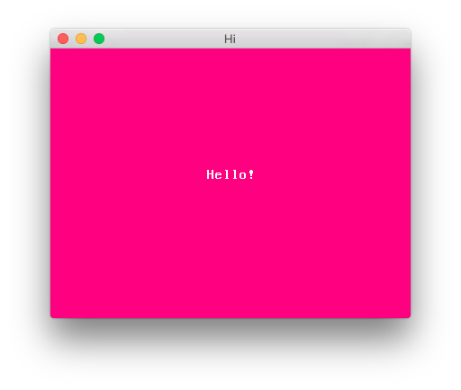
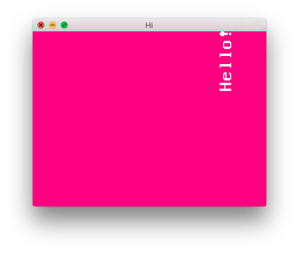

.. _quick-start:

Quick start
===========

Install Amulet
--------------

`Download <http://XXX.html>`__ the installer and run it.
(or if you're using Linux extract it to a folder and add it
to your PATH).

Run a script
------------

Create a text file called ``main.lua`` containing the following:

..  code-block:: lua

    log("It works!")

Open a terminal ("command prompt" on Windows) and change to the
folder containing the file. Then type ``amulet main.lua``:

..  code-block:: sh

    $ amulet main.lua
    test.lua:1: It works!

If you see the text ``test.lua:1: It works!`` Amulet is
installed and working.

Create a window
---------------

Type the following into main.lua:

..  code-block:: lua

    local win = am.window{
        title = "Hi",
        width = 400,
        height = 300,
        clear_color = vec4(1, 0, 0.5, 1)
    }

and run it as before. This time a bright pink window should appear.

Render some text
----------------

Add the following line to main.lua after the line that creates
the window:

..  code-block:: lua

    win.scene = am.camera2d(400, 300, vec2(0, 0)) ^ am.text("Hello!")

This sets up a scene with two nodes: A 2D camera with a 400x300 view
centered at (0, 0) and a text node. The text node is a child of the
camera node.

Transform the text
------------------

Change the scene setup command to:

..  code-block:: lua

    win.scene = am.camera2d(400, 300, vec2(0, 0))
        ^ am.translate(vec3(150, 100, 0))
        ^ am.scale(vec3(2))
        ^ am.rotate(math.rad(90))
        ^ am.text("Hello!")

This adds translate, scale and rotate nodes as parents of the text
node. These nodes transform the position, size and rotation of all their
children. The translate node moves it to the right 150 and up 100
(by convention the y axis increases in upward direction). The scale node
doubles its size and the rotate node rotates it by 90 degrees (math.rad
converts degrees to radians).

Animate!
--------

If you add the following to the end of main.lua:

..  code-block:: lua

    win.scene:action(function(scene)
        scene"translate".position = vec3(math.cos(am.frame_time) * 150, math.sin(am.frame_time) * 100, 0)
        scene"scale".scale = vec3(math.abs(math.sin(am.frame_time * 3)) + 0.5)
        scene"rotate".angle = am.frame_time * 4
    end)

the text will appear to bounce around the screen.

This code adds an *action* to the scene, which is a function that
is run once per frame. This action sets properties of the
translate, scale and rotate nodes we defined earlier using the
current frame time, causing them to animate.

Draw some shapes
----------------

Make things move
------------------

Draw images
-----------

Respond to key presses
-------------------------

Play sounds
--------------
