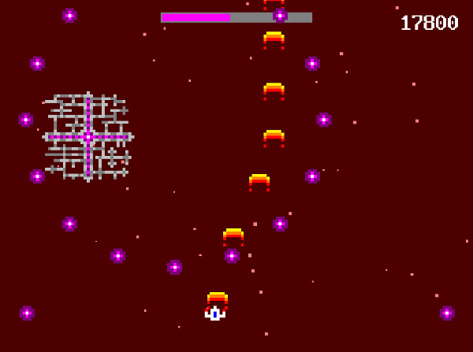
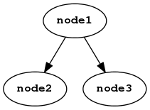
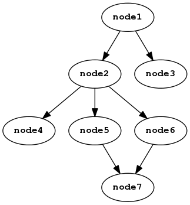
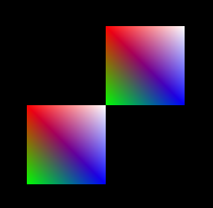

# Scenes {#scenes}

Scene graphs are how you draw graphics in Amulet.
*Scene nodes* are connected together to form a graph
which is attached to a window (via the window's [`scene`](#window.scene) field).
The window will then render the scene graph each frame.

Scene nodes correspond to graphics commands.
They either change the rendering
state in some way, for example by applying
a transformation or changing the blend mode,
or execute a draw command, which renders something
to the screen.

Each scene node has a list of children, which are
rendered in depth-first, left-to-right order.

A scene node may be the child of multiple other scene nodes, so in general a
scene node does not have a unique parent.  Cycles are also allowed and are
handled by imposing a limit to the number of times a node can be recursively
rendered.

## Scene graph construction syntax {#scene-graph-syntax}

Special syntax is provided for constructing scene graphs
from nodes. The expression:

~~~ {.lua}
node1 ^ node2
~~~

adds `node2` as a child of `node1` and returns `node1`. The
resulting scene graph looks like this:

The expression:

~~~ {.lua}
node1 ^ { node2, node3 }
~~~

adds both `node2` and `node3` as children of `node1`
and returns `node1`:

The expression:

~~~ {.lua}
node1 ^ { node2, node3 } ^ node4
~~~

does the same as the previous expression, except `node4` is
added as a child of both `node2` and `node3`:

If `node2` or `node3` were graphs with multiple nodes, then
`node4` would be added to the leaf nodes of those graphs.

Here is a more complex example:

~~~ {.lua}
node1 
    ^ node2
    ^ {
        node3
        ^ node4
        ,
        node5
        ^ {node6, node7, node8}
    }
    ^ node9
    ^ node10
~~~

The above expression results in the following graph:

## Scene node common fields and methods

The following fields and methods are common to all scene nodes.

### node.hidden {.func-def}

Determines whether the node and its children are rendered.
The default is `false`, meaning that the node is rendered.

Updatable.

### node.paused {.func-def}

Determines whether the node and its children's [actions](#node:action)
are executed. The default is `false`, meaning the actions
are executed.

Note that a descendant node's actions might still be executed
if it is has another, non-paused, parent.

Updatable.

### node.num_children {.func-def}

Returns the node's child count.

Readonly.

### node.recursion_limit {.func-def}

This determines the number of times the node will be rendered
recursively when part of a cycle in the scene graph.
The default is 8.

Updatable.

### node:tag(tagname) {#node:tag .method-def}

Adds a tag to a node and returns the node. `tagname` should be a string.

Note that most scene nodes receive a default tag name when they are
created. See the documentation of the different nodes
below for what these default tags are.

No more than 65535 unique tag names may be created in a single application.

### node:untag(tagname) {#node:untag .method-def}

Removes a tag from a node and returns the node.

### node:all(tagname [, recurse]) {#node:all .method-def}

Searches `node` and all its descendants for any nodes
with the tag `tagname` and returns them as a table.

The `recurse` boolean argument determines if `all` recursively searches the
descendents of matched nodes. The default value is `false`.

The returned table has a metatable that allows setting a field on all
nodes by setting the corresponding field on the table. So for example
to set the color of all sprite nodes that are descendents of
a parent node, one might do the following:

~~~ {.lua}
parent_node:all"sprite".color = vec4(1, 0, 0, 1)
~~~

### node(tagname) {#node:tagsearch .method-def}

Searches `node` and its descendants for `tagname`
and returns the first matching node found, or `nil`
if no matching nodes were found. The search is depth-first
left-to-right.

The found node's parent is also returned as a second
value, unless the found node was the root of the given subgraph.

### node:action([id,] action) {#node:action .method-def}

Attaches an action to a node and returns the node.

`action` may be a function or a coroutine.

The action function will be called exactly once per frame as long as the
node is part of a scene graph that is attached to a window.
If a coroutine is used, it will be run until it yields or finishes.
The action will be run for the first time
on the frame after it was attached to the node.

The action function may accept a single argument which is the node to which it
is attached. If a coroutine is used, then the node is returned by
`coroutine.yield()`.

If the action function returns `true` then the action will be 
removed from the node and not run again. Similarly if a coroutine
yields `true` or finishes.

Each action has an ID. If the `id` argument is
omitted, then its ID is the `action` argument itself. 
If present, `id` may be a value of any type besides nil, a function
or coroutine (typically it's a string).

Multiple actions may be attached to a scene node, but they
must all have unique ids. If you attempt to attach an action
with an ID that is already used by another action on the same
node, then the other action will be removed before the new one
is attached.

The order that actions are run is determined by the node's
position in the scene graph. Each node is visited in
depth-first, left-to-right order and the actions on each
node are run in the order they were added to the node.
Each action is never run more than once per frame, even if the node
occurs multiple times in the graph or is part of a cycle.
For example, given the following scene graph:

The nodes will be visited in this order:

- `node1`
- `node2`
- `node4`
- `node5`
- `node7`
- `node6`
- `node3`

Note that the action execution order is determined before
the first action runs each frame and is not affected by any modifications
to the scene graph made by actions running during the frame.
Any modifications to the scene graph will only affect the order of actions in
subsequent frames.

### node:late_action([id,] action) {#node:late_action .method-def}

Attach a *late action* to a scene node. Late actions are
the same as normal actions, except they are run after all
normal actions are finished.

See also [node:action](#node:action).

### node:cancel(id) {#node:cancel .method-def}

Cancels an action.

### node:update() {#node:update .method-def}

Executes actions on a node and its descendants. Actions are still only run
once per frame, so if the give node's actions have already been run, they
won't run again.

Use this method to execute actions on nodes that are not attached to the window,
for example nodes that are being manually rendered into a framebuffer.

### node:append(child) {.func-def}

Appends `child` to the end of `node`'s child list and returns `node`.

### node:prepend(child) {.func-def}

Adds `child` to the start of `node`'s child list and returns `node`.

### node:remove(child) {.func-def}

Removes the first occurrence of `child` from `node`'s child list
and returns `node`.

### node:remove(tagname) {.func-def}

Searches for a node with tag `tagname` in the descendants
of `node` and removes the first one it finds. 
Then returns `node`.

### node:remove_all() {.func-def}

Removes all of `node`'s children and returns `node`.

### node:replace(child, replacement) {.func-def}

Replaces the first occurrence of `child` with `replacement`
in `node`'s child list and returns `node`.

### node:replace(tagname, replacement) {.func-def}

Searches for a node with tag `tagname` in the descendants
of `node` and replaces the first one it finds with
`replacement`. Then returns `node`.

### node:child(n) {.func-def}

Returns the nth child of `node` (or `nil` if there is no such child).

### node:child_pairs() {.func-def}

Returns an iterator over all `node`'s children. For example:

~~~ {.lua}
for i, child in node:child_pairs() do
    -- do something with child
end
~~~

## Basic nodes

### am.group(children) {.func-def}

Group nodes are only for grouping child nodes under
a common parent. They have no other effect.
The children can be passed in as a table.

Default tag: `"group"`.

Example:

~~~ {.lua}
local group_node = am.group{node1, node2, node3}
~~~

### am.text([font, ] string [, color] [, halign [, valign]]) {#am.text .func-def}

Renders some text.

`font` is an object generated using the [sprite packing tool](#spritepack).
If omitted, the default font will be used, which is a monospace font
of size 16px.

`color` should be a `vec4`. The default color is white.

`halign` and `valign` specify horizontal and vertical alignment.
The allowed values for `halign` are `"left"`, `"right"` and `"center"`.
The allowed values for `valign` are `"bottom"`, `"top"` and `"center"`.
The default in both cases is `"center"`.

Fields:

- `text`: The text to display. Updatable.
- `color`: The color of the text. Updatable.
- `width`: The width of the displayed text in pixels. Readonly.
- `height`: The height of the displayed text in pixels. Readonly.

Default tag: `"text"`.

### am.sprite(source [, color] [, halign [, valign]]) {#am.sprite .func-def}

Renders a sprite (an image).

`source` can be either a filename, an ASCII art string or a *sprite spec*.

When `source` is a filename, that file is loaded and displayed as the
sprite. Currently only `.png` and `.jpg` files are supported. Note that
loaded files are cached, so each file will only be loaded once.

`source` may also be an ASCII art string. This is a string with at least
one newline character. Each row in the string represents a row of pixels.
Here's an example:

~~~ {.lua}
local face = [[
..YYYYY..
.Y.....Y.
Y..B.B..Y
Y.......Y
Y.R...R.Y
Y..RRR..Y
.Y.....Y.
..YYYYY..
]]
am.window{}.scene = am.scale(20) ^ am.sprite(face)
~~~

The resulting image looks like this:

The mapping from characters to colors is determined by the
`am.ascii_color_map` table. By default this is defined as:

~~~ {.lua}
am.ascii_color_map = {
    W = vec4(1, 1, 1, 1),          -- full white
    w = vec4(0.75, 0.75, 0.75, 1), -- silver
    K = vec4(0, 0, 0, 1),          -- full black
    k = vec4(0.5, 0.5, 0.5, 1),    -- dark grey
    R = vec4(1, 0, 0, 1),          -- full red
    r = vec4(0.5, 0, 0, 1),        -- half red (maroon)
    Y = vec4(1, 1, 0, 1),          -- full yellow
    y = vec4(0.5, 0.5, 0, 1),      -- half yellow (olive)
    G = vec4(0, 1, 0, 1),          -- full green
    g = vec4(0, 0.5, 0, 1),        -- half green
    C = vec4(0, 1, 1, 1),          -- full cyan
    c = vec4(0, 0.5, 0.5, 1),      -- half cyan (teal)
    B = vec4(0, 0, 1, 1),          -- full blue
    b = vec4(0, 0, 0.5, 1),        -- half blue (navy)
    M = vec4(1, 0, 1, 1),          -- full magenta
    m = vec4(0.5, 0, 0.5, 1),      -- half magenta
    O = vec4(1, 0.5, 0, 1),        -- full orange
    o = vec4(0.5, 0.25, 0, 1),     -- half orange (brown)
}
~~~

but you can modify it as you please (though this must be
done before creating a sprite).

Any characters not in the color map will come out as
transparent pixels, except for space characters which are
ignored.

The third kind of source is a *sprite spec*.
Sprite specs are usually generated using the [sprite packing tool](#spritepack),
though you can create them manually as well if you like.

You can define your own sprite spec by supplying a
table with all of the following fields:

- `texture`: the [texture](#am.texture2d) containing the sprite.
- `s1`: the left texture coordinate (0 to 1)
- `t1`: the bottom texture coordinate (0 to 1)
- `s2`: the right texture coordinate (0 to 1)
- `t2`: the top texture coordinate (0 to 1)
- `x1`: the left offset of the sprite (in pixels)
- `y1`: the bottom offset of the sprite (in pixels)
- `x2`: the right offset of the sprite (in pixels)
- `y2`: the top offset of the sprite (in pixels)
- `width`: the width of the sprite (in pixels)
- `height`: the height of the sprite (in pixels)

Typically `x1` and `y1` would both be zero
and `x2` and `y2` would be equal to `width` and `height`,
though they may be different when transparents pixels
are removed from the edges of sprites when packing them.
The `width` and `height` fields are used for adjusting sprite
position based on the requested alignment.

The `color` argument is a `vec4` that applies a tinting color to the sprite.
The default is white (no tinting).

The `halign` and `valign` arguments determine the alignment
of the sprite.
The allowed values for `halign` are `"left"`, `"right"` and `"center"`.
The allowed values for `valign` are `"bottom"`, `"top"` and `"center"`.
The default in both cases is `"center"`.

Fields:

- `source`: The sprite source (filename, ascii art string or sprite spec). Updatable.
- `color`: The sprite tint color as a `vec4`. Updatable.
- `width`: The width of the sprite in pixels.
- `height`: The height of the sprite in pixels.
- `spec`: The sprite spec table, from which you can retrieve the texture,
  texture coordinates and vertices. This is available even if the
  sprite wasn't created with a sprite spec. Readonly.

Default tag: `"sprite"`.

### am.rect(x1, y1, x2, y2 [, color]) {#am.rect .func-def}

Draws a rectangle from (`x1`, `y1`) to (`x2`, `y2`).

`color` should be a `vec4` and defaults to white.

Fields:

- `x1`: The left coordinate of the rectangle. Updatable.
- `y1`: The bottom coordinate of the rectangle. Updatable.
- `x2`: The right coordinate of the rectangle. Updatable.
- `y2`: The top coordinate of the rectangle. Updatable.
- `color`: The color of the rectangle as a `vec4`. Updatable.

Default tag: `"rect"`.

### am.circle(center, radius [, color [, sides]]) {#am.circle .func-def}

Draws a circle or regular polygon.

`center` should be a `vec2`.

`color` should be a `vec4`. The default is white.

`sides` is the number of sides to use when rendering the
circle. The default is 255. You can change this to make
other regular polygons. For example change it to 6 to
draw a hexagon.

Fields:

- `center`: The circle center as a `vec2`. Updatable.
- `radius`: The circle radius. Updatable.
- `color`: The circle color as a `vec4`. Updatable.

Default tag: `"circle"`.

### am.line(point1, point2 [, thickness [, color]]) {#am.line .func-def}

Draws a line from `point1` to `point2`.

`point1` and `point1` should be `vec2`s.

`thickness` should be a number. The default is 1.

`color` should be a `vec4`. The default is white.

Fields:

- `point1`: Updatable.
- `point2`: Updatable.
- `thickness`: Updatable.
- `color`: Updatable.

Default tag: `"line"`.

### am.particles2d(settings) {#am.particles2d .func-def}

Renders a simple 2D particle system.

`settings` should be a table with any of the following fields:

- `source_pos`: The position where the particles emit from (`vec2`)
- `source_pos_var`: The source position variation (`vec2`)
- `start_size`: The start size of the particles (number)
- `start_size_var`: The start size variation (number)
- `end_size`: The end size of the particles (number)
- `end_size_var`: The end size variation (number)
- `angle`: The angle the particles emit at (radians)
- `angle_var`: The variation in the angle the particles emit at (radians)
- `speed`: The speed of the particles (number)
- `speed_var`: The variation in the speed of the particles (number)
- `life`: The lifetime of the particles (seconds)
- `life_var`: The variation in lifetime of the particles (seconds)
- `start_color`: The start color of the particles (`vec4`)
- `start_color_var`: The variation in the start color of the particles (`vec4`)
- `end_color`: The end color of the particles (`vec4`)
- `end_color_var`: The variation in the end color of the particles (`vec4`)
- `emission_rate`: The number of particles to emit per second
- `start_particles`: The initial number of particles
- `max_particles`: The maximum number of particles
- `gravity`: Gravity to apply to the particles (`vec2`)
- `damping`: Slows down particles if greater than zero
- `sprite_source`: The particle sprite source (see [am.sprite](#am.sprite)). If this is omitted the particles will be colored squares.
- `warmup_time`: Simulate running the particle system for this number of seconds before showing it for the first time.

In the table the `_var` fields are an amount that is added to
and subtracted from the corresponding field (the one without the `_var` suffix)
to get the range of values from which one is randomly chosen.
For example if `source_pos` is `vec2(1, 0)` and `source_pos_var` is
`vec2(3, 2)`, then source positions will be chosen in the
range `vec2(-2, -2)` to `vec2(4, 2)`.

All of the sprite settings are exposed as updatable fields on
the particles node.

Note that no blending is applied to the particles, so if you want alpha on your
particles, then you need to add a [`am.blend`](#am.blend) node. For example:

~~~ {.lua}
local node = am.blend("add_alpha")
    ^ am.particles2d{
        source_pos = win:mouse_position(),
        source_pos_var = vec2(20),
        max_particles = 1000,
        emission_rate = 500,
        start_particles = 0,
        life = 0.4,
        life_var = 0.1,
        angle = math.rad(90),
        angle_var = math.rad(180),
        speed = 200,
        start_color = vec4(1, 0.3, 0.01, 0.5),
        start_color_var = vec4(0.1, 0.05, 0.0, 0.1),
        end_color = vec4(0.5, 0.8, 1, 1),
        end_color_var = vec4(0.1),
        start_size = 30,
        start_size_var = 10,
        end_size = 2,
        end_size_var = 2,
        gravity = vec2(0, 2000),
    }
~~~

Methods:

- `reset()`: resets the particles as if they had just been created with their
  current settings.

Default tag: `"particles2d"`.

## Transformation nodes

The following nodes apply transformations to all
their descendants.

**Note**:
These nodes have an optional `uniform` argument in the
first position of their construction functions. This
argument is only relevant if you're writing your own shader
programs. Otherwise you can ignore it.

### am.translate([uniform,] position) {#am.translate .func-def}

Apply a translation to a 4x4 matrix uniform.
`uniform` is the uniform name as a string.
It is `"MV"` by default.

`position` may be either 2 or 3 numbers (the
x, y and z components) or a `vec2` or `vec3`. 

If the z component is omitted it is assumed to
be 0.

Fields:

- `position`: The translation position as a `vec3`. Updatable.
- `position2d`: The translation position as a `vec2`. Updatable.
- `x`, `y`, `z`: The `x`, `y` and `z` components of the position. Updatable.

Default tag: `"translate"`.

Examples:

~~~ {.lua}
local node1 = am.translate(10, 20)
local node2 = am.translate(vec2(10, 20))
local node3 = am.translate("MyModelViewMatrix", 1, 2, -3.5)
local node4 = am.translate(vec3(1, 2, 3))
node1.position2d = vec2(30, 40)
node2.x = 40
node2.y = 50
node3.position = vec3(1, 2, -3)
~~~

### am.scale([uniform,] scaling) {#am.scale .func-def}

Apply a scale transform to a 4x4 matrix uniform.
`uniform` is the uniform name as a string.
It is `"MV"` by default.

`scaling` may be 1, 2 or 3 numbers or a
`vec2` or `vec3`. If 1 number is provided
it is assume to be the x and y components
of the scaling and the z scaling is assumed
to be 1. If 2 numbers or a `vec2` is provided,
they are the scaling for the x and y components
and z is assumed to be 1.

Fields:

- `scale`: The scale as a `vec3`. Updatable.
- `scale2d`: The scale as a `vec2`. Updatable.
- `x`, `y`, `z`: The `x`, `y` and `z` components of the scale. Updatable.

Default tag: `"scale"`.

Examples:

~~~ {.lua}
local node1 = am.scale(2)
local node2 = am.scale(2, 1)
local node3 = am.scale(vec2(1, 2))
local node4 = am.scale("MyModelViewMatrix", vec3(0.5, 2, 3))
node1.scale2d = vec2(1)
node2.x = 3
node4.scale = vec3(1, 3, 2)
~~~

### am.rotate([uniform,] rotation) {#am.rotate .func-def}

Apply a rotation to a 4x4 matrix uniform.
`uniform` is the uniform name as a string.
It is `"MV"` by default.

`rotation` can be either a quaternion, or
an angle (in radians) followed by an optional `vec3` axis.
If the axis is omitted it is assumed to be `vec3(0, 0, 1)`
so the rotation becomes a 2D rotation in the xy plane about
the z axis.

Fields:

- `rotation`: The rotation as a `quat`. Updatable.
- `angle`: The rotation angle in radians. Updatable.
- `axis`: The rotation axis as a `vec3`. Updatable.

Default tag: `"rotate"`.

Examples:

~~~ {.lua}
local node1 = am.rotate(math.rad(45))
local node2 = am.rotate(math.pi/4, vec3(0, 1, 0))
local node3 = am.rotate("MyModelViewMatrix", 
    quat(math.pi/6, vec3(1, 0, 0)))
node1.angle = math.rad(60)
node2.axis = vec3(0, 0, 1)
node3.rotation = quat(math.rad(60), vec3(0, 0, 1))
~~~

### am.transform([uniform,] matrix) {#am.transform .func-def}

Pre-multiply a 4x4 matrix uniform by the given 4x4 matrix.
`uniform` is the uniform name as a string (default is `"MV"`).

Fields:

- `mat`: The matrix to multiply the uniform by. Updatable.

Default tag: `"transform"`.

## Advanced nodes

### am.use_program(program) {#am.use_program .func-def}

Sets the [shader program](#shader-programs) to use when
rendering descendants. A `program` object can be
created using the [`am.program`](#am.program) function.

Fields:

- `program`: The shader program to use. Updatable.

Default tag: `"use_program"`.

### am.bind(bindings) {#am.bind .func-def}

Binds [shader program](#shader-programs) parameters (uniforms and attributes)
to values.
`bindings` is a table mapping shader parameter names
to values.

The named parameters are matched with the
uniforms and attributes in the shader program just before 
a [`am.draw`](#am.draw) node is
executed.

Program parameter types are mapped to the following Lua types:

Program parameter type      Lua type
-----------------------     ---------------------------------------
`float` uniform             `number`
`vec2` uniform              [`vec2`](#vectors)
`vec3` uniform              [`vec3`](#vectors)
`vec4` uniform              [`vec4`](#vectors)
`mat2` uniform              [`mat2`](#matrices)
`mat3` uniform              [`mat3`](#matrices)
`mat4` uniform              [`mat4`](#matrices)
`sampler2D` uniform         [`texture2d`](#am.texture2d)
`float` attribute           [`view("float")`](#buffers-and-views)
`vec2` attribute            [`view("vec2")`](#buffers-and-views)
`vec3` attribute            [`view("vec3")`](#buffers-and-views)
`vec4` attribute            [`view("vec4")`](#buffers-and-views)

Any bound parameters not in the program are ignored,
but all program parameters must have been bound before
a `draw` node is executed.

**Note**:
The parameter `P` is initially bound to a 4x4 projection
matrix defined by the window's coordinate system, while the parameter `MV`
(the default model view matrix) is initially bound to the 4x4 identity matrix.

The bound parameters are available as updatable fields on the bind node.
The fields have the same names as their corresponding parameters.

Default tag: `"bind"`.

Example:

~~~ {.lua}
local bind_node = am.bind{
    P = mat4(1),
    MV = mat4(1),
    color = vec4(1, 0, 0, 1),
    vert = am.vec2_array{
        vec2(-1, -1),
        vec2(0, 1),
        vec2(1, -1)
    }
}
-- update a parameter
bind_node.color = vec4(0, 1, 1, 1)
~~~

### am.draw(primitive [, elements] [, first [, count]]) {#am.draw .func-def}

Draws the currently bound vertices using
the current shader program with the
currently bound parameter values.

`primitive` can be one of the following:

- `"points"`
- `"lines"`
- `"line_strip"`
- `"line_loop"`
- `"triangles"`
- `"triangle_strip"`
- `"triangle_fan"`

Note that `"line_loop"` and `"triangle_fan"` may be slow on some systems.

`elements`, if supplied, should be a `ushort_elem` or `uint_elem`
view containing 1-based attribute indices. If omitted the attributes
are rendered in order as if `elements` were 
1, 2, 3, 4, 5, ... etc. See also [buffers and views](#buffers-and-views).

`first` specifies where in the list of vertices to start drawing
(starting from 1).  The default is 1.

`count` specifies how many vertices to draw. The default is as
many as are supplied through bound vertex attributes
and the `elements` view if present.

Fields:

- `primitive`: The primitive to draw. Updatable.
- `elements`: The elements view. Updatable.
- `first`: The first vertex to draw. Updatable.
- `count`: The number of vertices to draw. Updatable.

Default tag: `"draw"`.

Here is a complete example that draws a triangle with
red, green and blue corners using [`am.use_program`](#am.use_program),
[`am.bind`](#am.bind) and [`am.draw`](#am.draw) nodes:

~~~ {.lua}
local win = am.window{}
local prog = am.program([[
    precision highp float;
    attribute vec2 vert;
    attribute vec4 color;
    uniform mat4 MV;
    uniform mat4 P;
    varying vec4 v_color;
    void main() {
        v_color = color;
        gl_Position = P * MV * vec4(vert, 0.0, 1.0);
    }
]], [[
    precision mediump float;
    varying vec4 v_color;
    void main() {
        gl_FragColor = v_color;
    }
]])
win.scene =
    am.use_program(prog)
    ^ am.bind{
        P = mat4(1),
        MV = mat4(1),
        color = am.vec4_array{
            vec4(1, 0, 0, 1),
            vec4(0, 1, 0, 1),
            vec4(0, 0, 1, 1)
        },
        vert = am.vec2_array{
            vec2(-1, -1),
            vec2(0, 1),
            vec2(1, -1)
        }
    }
    ^ am.draw"triangles"
~~~

The resulting image looks like this:

### am.blend(mode) {#am.blend .func-def}

Set the blending mode.

The possible values for `mode` are:

- `"off"`
- `"alpha"`
- `"premult"`
- `"add"`
- `"subtract"`
- `"add_alpha"`
- `"subtract_alpha"`
- `"multiply"`
- `"invert"`

Fields:

- `mode`: Updatable.

### am.color_mask(red, green, blue, alpha) {.func-def}

Apply a color mask. The four arguments can be `true` or `false`
and determine whether the corresponding color channel
is updated in the rendering target (either the current window
or framebuffer being rendered to).

For example using a mask of `am.color_mask(false, true, false, true)`
will cause only the green and alpha channels to be updated.

Fields:

- `red`: Updatable.
- `green`: Updatable.
- `blue`: Updatable.
- `alpha`: Updatable.

Default tag: `"color_mask"`.

### am.cull_face(face) {.func-def}

Culls triangles with a specific winding.

The possible values for `face` are:

- `"back"`: Cull back-facing triangles (same as `"cw"` below)
- `"front"`: Cull front-facing triangles (same as `"ccw"` below)
- `"cw"`: Cull clockwise wound triangles.
- `"ccw"`: Cull counter-clockwise wound triangles.
- `"none"`: Do not cull any triangles.

Fields:

- `face`: Updatable.

Default tag: `"cull_face"`.

### am.depth_test(func [, mask]) {#am.depth_test .method-def}

Sets the depth test function and mask. The window
or framebuffer being rendered to needs to have a depth
buffer for this to have any effect.

`func` is used to determine whether a fragment
is rendered by comparing the depth value of the
fragment to the value in the depth buffer.
The possible values for `func` are:

- `"never"`
- `"always"`
- `"equal"`
- `"notequal"`
- `"less"`
- `"lequal"`
- `"greater"`
- `"gequal"`

`mask` determines whether the fragment depth is
written to the depth buffer. The possible
values are `true` and `false`. The default is `true`.

Fields:

- `func`: Updatable.
- `mask`: Updatable.

Default tag: `"depth_test"`.

### am.stencil_test(settings) {#am.stencil_test .method-def}

Sets the stencil test and mask. The window
or framebuffer being rendered to needs to have a stencil
buffer for this to have any effect.

`settings` should be a table with any combination of the following
fields:

- `enabled`: whether the stencil test is enabled (`true`/`false`, default `false`)
- `ref`: the reference value to use in the test function
  (must be an integer between 0 and 255, default 0).
- `read_mask`: a bitmask to apply to the reference value and the stencil buffer
  value before doing the test (must be an integer between 0 and 255, default 255).
- `write_mask`: a bitmask that controls which stencil buffer bits can be written to
  (must be an integer between 0 and 255, default 255).
- `func_front`: the test function to use for front-facing (CCW) triangles 
  (`"never"`, `"always"`, `"equal"`, `"notequal"`, `"less"`, `"lequal"`,
  `"greater"` or `"gequal"`, default `"always"`). The function compares
  a supplied reference value with the value in the stencil buffer.
- `op_fail_front`: The operation to perform if the stencil test fails
  (see below for possible values).
- `op_zfail_front`: The operation to perform if the stencil test passes, but the depth test fails 
  (see below for possible values).
- `op_zpass_front`: The operation to perform if the stencil test passes and the depth test passes
  (see below for possible values).
- `func_back`: same as `func_front`, but for back-facing (CW) triangles.
- `op_fail_back`: same as `op_fail_front`, but for back-facing (CW) triangles.
- `op_zfail_back`: same as `op_zfail_front`, but for back-facing (CW) triangles.
- `op_zpass_back`: same as `op_zpass_front`, but for back-facing (CW) triangles.

The `op_fail_front`, `op_zfail_front` and `op_zpass_front` fields (and the analogous fields
for back-facing triangles) determine how the stencil buffer is modified. They can be one of the
following values:

- `"keep"`: keeps the existing stencil buffer value
- `"zero"`: sets the stencil buffer  to zero
- `"replace"`: replaces the stencil buffer value with the supplied reference value
- `"invert"`: invert the bits of the stencil buffer
- `"incr"`: increment the stencil buffer value
- `"decr"`: decrement the stencil buffer value
- `"incr_wrap"`: increment the stencil buffer value, wrapping back to zero on overflow (> 255)
- `"decr_wrap"`: decrement the stencil buffer value, wrapping to 255 on underflow

All the settings can be updated after the depth test node has been created using
fields on the node with the corresponding names.

Default tag: `"stencil_test"`.

### am.viewport(left, bottom, width, height) {#am.viewport .func-def}

Set the viewport, which is the rectangular area
of the window into which rendering will occur.

`left` and `bottom` is the bottom-left corner
of the viewport in pixels, where the bottom-left corner
of the window is (0, 0). `width` and `height` are
also in pixels.

Fields:

- `left`, `bottom`, `width`, `height`: Updatable.

Default tag: `"viewport"`.

### am.lookat([uniform,] eye, center, up) {#am.lookat .func-def}

Sets `uniform` to the "lookat matrix" which looks from `eye` (a `vec3`)
to `center` (a `vec3`), with `up` (a unit `vec3`) as the up direction.

This node can be thought of a camera positioned at `eye` and
facing the point `center`.

The default value for `uniform` is `"MV"`.

Fields:

- `eye`: The camera position (`vec3`). Updatable.
- `center`: A point the camera is facing (`vec3`). Updatable.
- `up`: The up direction of the camera (`vec3`). Updatable.

Default tag: `"lookat"`.

### am.cull_sphere([uniforms...,] radius [, center]) {#am.cull_sphere .func-def}

This first takes the matrix product of the given uniforms (which should be
`mat4`s). Then it determines whether the sphere with the given center
and radius would be visible using the previously computed matrix
product as the model-view-projection matrix. If it wouldn't be visible then
none of this node's children are rendered (i.e. they are culled).

The default value for `uniforms` is `"P" and "MV"` and the default
value for `center` is `vec3(0)`.

Fields:

- `radius`: Updatable.
- `center`: Updatable.

Default tag: `"cull_sphere"`.

### am.cull_box([uniforms...,] min, max) {#am.cull_box .func-def}

This first takes the matrix product of the given uniforms (which should be
`mat4`s). Then it determines whether the box with the min and max coordinates
(`min` and `max` are `vec3`s)
would be visible using the computed matrix
product as the model-view-projection matrix. If it wouldn't be visible then
none of this node's children are rendered.

The default value for `uniforms` is `"P" and "MV"`.

Fields:

- `min`: Updatable.
- `max`: Updatable.

Default tag: `"cull_box"`.

### am.billboard([uniform,] [preserve_scaling]) {#am.billboard .func-def}

Removes rotation from `uniform`, which should be a `mat4`.
By default `uniform` is `"MV"`.

If `preserve_scaling` is `false` or omitted then any scaling
will also be removed from the matrix. If it is `true`, then
scaling will be preserved, as long as it's the same across
all three axes.

Default tag: `"billboard"`

### am.read_uniform(uniform) {#am.read_param .func-def}

This node has no effect on rendering. Instead it records the
value of the named uniform when rendering occurs.

This is useful for finding the value of the model-view matrix (`MV`) at a
specific node without having to keep track of all the ancestor transforms. This
could then be used to, for example, determine the position of a mouse click
in a node's coordinate space, by taking the inverse of the model-view matrix.

Fields:

- `value`: The value of the uniform, or nil if
  the node hasn't been rendered yet,
  or the named uniform wasn't set in an ancestor node.

Default tag: `"read_uniform"`.

### am.quads(n, spec [, usage]) {#am.quads .func-def}

Returns a node that renders a set of quads. The returned node
is actually an [`am.bind`](#am.bind) node with an [`am.draw`](#am.draw)
node child. i.e. no program or blending is defined -- these
must be created separately as parent nodes.

`n` is the initial capacity. Set this to the number of quads you think
you'll want to render. It doesn't matter if it's too small as the
capacity will be increased as required, though it's slightly faster
if no capacity increases are required.

`spec` is a table of attribute name and type pairs (the same
as used for [`am.struct_array`](#am.struct_array) ).

`usage` is an optional hint to the graphics driver about how the
quads will be used. See the `usage` property of [`am.buffer`](#am.buffer)
for more details.

Fields:

- `num_quads`: The number of quads. This is zero
  initially.

Methods:

- `add_quad(data)`: adds a quad to be rendered and returns
  the quad number. `data` is a table where the keys are attribute names and the
  values are the values of the 4 vertices of the quad.
  The values can be specified in several ways:
    - as a table where each each element is the value for the
      left-top, left-bottom, right-bottom and right-top 
      corners of the quad.
    - a single value for all corners.
    - a view containing the values for the elements
  As with the [`view:set`](#view:set) method, if the attribute
  is a vector, a table of numbers is also accepted.
  The quad number (starting at 1) is returned.
- `remove_quad(n [,count])`: Removes `count` quads starting with the `n`th.
  `count` is 1 if omitted.
- `clear()`: Removes all quads.
- Additionally methods are created for each attribute
  of the form `quad_<attribute name>` that can be
  used to update the value of a quad attribute.
  The signature of the method is: `quad_attr(n, values)`
  where `n` is the quad number and `values` has the
  same meaning as in the `add_quad` method.

Default tag: `"quads"`.

Example:

~~~ {.lua}
local quads = am.quads(2, {"vert", "vec2", "color", "vec3"})
quads:add_quad{vert = {vec2(-100, 0), vec2(-100, -100),
                       vec2(0, -100), vec2(0, 0)},
               color = {vec3(1, 0, 0), vec3(0, 1, 0),
                        vec3(0, 0, 1), vec3(1, 1, 1)}}
quads:add_quad{vert = {vec2(0, 100), vec2(0, 0),
                       vec2(100, 0), vec2(100, 100)},
               color = {vec3(1, 0, 0), vec3(0, 1, 0),
                        vec3(0, 0, 1), vec3(1, 1, 1)}}
local win = am.window{}
local prog = am.program([[
    precision highp float;
    attribute vec2 vert;
    attribute vec3 color;
    uniform mat4 MV;
    uniform mat4 P;
    varying vec3 v_color;
    void main() {
        v_color = color;
        gl_Position = P * MV * vec4(vert, 0.0, 1.0);
    }
]], [[
    precision mediump float;
    varying vec3 v_color;
    void main() {
        gl_FragColor = vec4(v_color, 1.0);
    }
]])
win.scene = am.use_program(prog) ^ quads
~~~

The above program produces the following output:

### am.postprocess(settings) {#am.postprocess .func-def}

Allows for post-processing of a scene. First the children
of the `postprocess` node are rendered into a texture, then
the texture is rendered to the entire window using a user-supplied
shader program.

`settings` is a table containing any number of the following fields:

- `width`: the width of the texture to render the children into. If omitted the window width is used.
- `height`: the height of the texture to render the children into. If omitted the window height is used.
- `minfilter`: the [minfilter](#texture.minfilter) of the texture. The default is `"nearest"`.
- `magfilter`: the [magfilter](#texture.magfilter) of the texture. The default is `"nearest"`.
- `depth_buffer`: whether there should be a depth buffer when rendering the scene. The default is false.
- `stencil_buffer`: whether there should be a stencil buffer when rendering the scene. The default is false.
- `clear_color`: The color to clear the texture to before rendering each frame (a `vec4`). The default is black.
- `auto_clear`: Whether to automatically clear the texture before rendering each frame. The default is true.
- `program`: The shader program to use to render the texture.
- `bindings`: An optional table of user bindings to pass into the `program`. The keys/values are added to the `am.bind(...)` node used internally.

The shader program should expect the following uniforms and attributes:

~~~ {.glsl}
uniform sampler2D tex;
attribute vec2 vert;
attribute vec2 uv;
~~~

Note that if either `width` or `height` are set then they must both
be set.

Fields:

- `clear_color`: The color to clear the texture to before rendering each frame (a `vec4`). Updatable.
- `auto_clear`: Whether to automatically clear the texture before rendering each frame. Updatable.
- `program`: The shader program to use to render the texture. Updatable.

Methods:

- `clear()`: Clear the texture manually.

Default tag: `"postprocess"`.

## Creating custom scene nodes

Creating a custom leaf node is relatively simple: just create
a function that constructs the graph you want and return it.

You can add custom methods by setting the appropriate fields on
the root node of the returned graph  (any node can have any number
of custom fields set on it, as long as they don't clash with
pre-defined fields).

If you define methods of the form:

~~~ {.lua}
function node:get_FIELD()
    ...
end

function node:set_FIELD(val)
    ...
end
~~~

Then you will be able to access `FIELD` as if it's a regular field
and the appropriate access method will be called.

For example:

~~~ {.lua}
node.FIELD = val
~~~

will be equivalent to:

~~~ {.lua}
node:set_FIELD(val)
~~~

If you want a readonly field, just define the `get_FIELD` method
and not the `set_FIELD` method.

The [`am.text`](#am.text), [`am.sprite`](#am.sprite) and
[`am.particles2d`](#am.particles2d) nodes are all implemented this
way. Their source is [here](https://github.com/ianmaclarty/amulet/blob/master/lua/text.lua)
and [here](https://github.com/ianmaclarty/amulet/blob/master/lua/particles.lua).

If you want to create a non-leaf node, then you need to use the `am.wrap` function:

### am.wrap(node) {#am.wrap .func-def}

This "wraps" `node` inside a special type of node called
a *wrap node*.

When a wrap node is rendered it renders the inner node.
However any nodes added as children of a wrap node are also
added to the leaf node(s) of the inner node.

For example suppose we want to create a transformation node
called `move_and_rotate` that does both a translation and a rotation:

~~~ {.lua}
function move_and_rotate(x, y, degrees)
    return am.translate(x, y) ^ am.rotate(math.rad(degrees))
end
~~~

We would like to be able to create such a node and
add children to it. Like so:

~~~ {.lua}
local mvrot = move_and_rotate(10, 20, 60)
mvrot:append(am.rect(-10, -10, 10, 10))
~~~

However what this will do is add the `rect` node as a
child of the `translate` node returned by `move_and_rotate`.

Instead we need to do:

~~~ {.lua}
mvrot"rotate":append(am.rect(-10, -10, 10, 10))
~~~

which is a bit clunky.

A wrap node solves this problem:

~~~ {.lua}
function move_and_rotate(x, y, degrees)
    return am.wrap(am.translate(x, y) ^ am.rotate(math.rad(degrees)))
end
local mvrot = move_and_rotate(10, 20, 60)
mvrot:append(am.rect(-10, -10, 10, 10))
~~~

For completeness here we add some fields to set the x, y and degrees properties
of our new node:

~~~ {.lua}
function move_and_rotate(x, y, degrees)
    local inner = am.translate(x, y) ^ am.rotate(math.rad(degrees))
    local wrapped = am.wrap(inner)
    function wrapped:get_x()
        return x
    end
    function wrapped:set_x(v)
        x = v
        inner.position2d = vec2(x, y)
    end
    function wrapped:get_y()
        return y
    end
    function wrapped:set_y(v)
        y = v
        inner.position2d = vec2(x, y)
    end
    function wrapped:get_degrees()
        return degrees
    end
    function wrapped:set_degrees(v)
        degrees = v
        inner"rotate".angle = math.rad(degrees)
    end
    return wrapped
end
local mvrot = move_and_rotate(-100, -100, 0)
mvrot:append(am.rect(-50, -50, 50, 50))
mvrot.x = 100
mvrot.y = 100
mvrot.degrees = 45
~~~

There are some caveats when using wrap nodes:

- The inner node is not considered part of the scene
  graph for the purpose of running actions. So any actions
  need to be attached to the wrap node, not the inner node.
- Tag search functions do not search the inner node.

The [`am.postprocess`](#am.postprocess) node is implemented using
a wrap node. You can view it's implementation [here](https://github.com/ianmaclarty/amulet/blob/master/lua/postprocess.lua).
