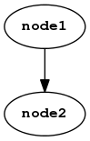

# Scenes {#scenes}

Scene graphs are how you draw graphics in Amulet.
*Scene nodes* are connected together to form a scene graph
which is attached to a window. The window will then
render the scene graph each frame.

Scene nodes correspond to graphics commands.
They either change the rendering
state in some way, for example by applying
a transformation or changing the blend mode,
or execute a draw command, which renders something
to the screen.

Each scene node has a list of children, which are
rendered in order.

A scene node may be the child of multiple other scene nodes, so in general a
scene node does not have a unique parent.  Cycles are also allowed and are
handled by imposing a limit to the number of times a node can be recursively
rendered.

## Scene graph construction syntax

Special syntax is provided for constructing scene graphs
from nodes. The expression:

~~~ {.lua}
node1 ^ node2
~~~

adds `node2` as a child of `node1` and returns `node1`. The
resulting scene graph looks like this:

The expression:

~~~ {.lua}
node1 ^ { node2, node3 }
~~~

adds both `node2` and `node3` as children of `node1`
and returns `node1`:

The expression:

~~~ {.lua}
node1 ^ { node2, node3 } ^ node4
~~~

does the same as the previous expression, except `node4` is
added as a child of both `node2` and `node3`:

If `node2` or `node3` were graphs with multiple nodes, then
`node4` would be added to the leaf nodes of those graphs.

Here is a more complex example:

~~~ {.lua}
node1 
    ^ node2
    ^ {
        node3
        ^ node4
        ,
        node5
        ^ {node6, node7, node8}
    }
    ^ node9
    ^ node10
~~~

The above expression results in the following graph:

## Scene node common fields and methods

The following fields and methods are common to all scene nodes.

### node.hidden {.func-def}

Determines whether the node and its children are rendered.
The default is `false`, meaning that the node is rendered.

Updatable.

### node.paused {.func-def}

Determines whether the node and its children's actions
are executed. The default is `false`, meaning the actions
are executed.

Note that a descendent node's actions might still be executed
if it is has another, non-paused, parent.

Updatable.

### node.num_children {.func-def}

Returns the node's child count.

Readonly.

### node.recursion_limit {.func-def}

This determines the number of times the node will be rendered
recursively when part of a cycle in the scene graph.
The default is 8.

Updatable.

### node:tag(tagname) {#node:tag .method-def}

Adds a tag to a node and returns the node. `tagname` should be a string.

Note that most scene nodes receive a default tag name when they are
created. See the documentation of the different nodes
below for what these default tags are.

No more than 65535 unique tag names may be created in a single application.

### node:untag(tagname) {#node:untag .method-def}

Removes a tag from a node and returns the node.

### node:all(tagname) {#node:all .method-def}

Searches `node` and all its descendents for any nodes
with the tag `tagname` and returns them as a table.

### node(tagname) {#node:tagsearch .method-def}

Searches `node` and its descendents for `tagname`
and returns the first matching node found, or `nil`
if no matching nodes were found. The search is depth-first
left-to-right.

### node:action([id,] action) {#node:action .method-def}

Attaches an action to a node and returns the node.

`action` may be a function or a coroutine.

The action function will be called exactly once per frame as long as the
node is part of a scene graph that is attached to a window.
If a coroutine is used, it will be run until it yields or finishes.
The action will be run for the first time
on the frame after it was attached to the node.

The action function may accept a single argument which is the node to which it
is attached. If a coroutine is used, then the node is returned by
`coroutine.yield()`.

If the action function returns `true` then the action will be 
removed from the node and not run again. Similarly if a coroutine
yields `true` or finishes.

Each action has an ID. If the `id` argument is
omitted, then its ID is the value of the `action`
argument. If present, `id` may be a value of any type besides nil, a function
or coroutine (typically it's a string).

Multiple actions may be attached to a scene node, but they
must all have unique ids. If you attempt to attach an action
with an ID that is already used by another action on the same
node, then the other action will be removed before the new one
is attached.

The order that actions are run is determined by the node's
position in the scene graph. Each node is visited in
depth-first, left-to-right order and the actions on each
node are run in the order they were added to the node.
Each action is never run more than once, even if the node
occurs multiple times in the graph or is part of a cycle.
For example, given the following scene graph:

The nodes will be visited in this order:

- `node1`
- `node2`
- `node4`
- `node5`
- `node7`
- `node6`
- `node3`

Note that the action execution order is determined before
the first action runs and is not affected by any modifications
actions make to the scene graph (these modifications will only
affect the order of actions in subsequent frames).

### node:late_action([id,] action) {#node:late_action .method-def}

Attach a *late action* to a scene node. Late actions are
the same as normal actions, except they are run after all
normal actions are finished.

See also [node:action](#node:action).

### node:cancel(id) {#node:cancel .method-def}

Cancels an action.

### node:append(child) {.func-def}

Appends `child` to the end of `node`'s child list and returns `node`.

### node:prepend(child) {.func-def}

Adds `child` to the start of `node`'s child list and returns `node`.

### node:remove(child) {.func-def}

Removes the first occurance of `child` from `node`'s child list
and returns `node`.

### node:remove(tagname) {.func-def}

Searches for a node with tag `tagname` in the descendents
of `node` and removes the first one it finds and
returns `node`.

### node:remove_all() {.func-def}

Removes all of `node`'s children and returns `node`.

### node:replace(child, replacement) {.func-def}

Replaces the first occurance of `child` with `replacement`
in `node`'s child list and returns `node`.

### node:replace(tagname, replacement) {.func-def}

Searches for a node with tag `tagname` in the descendents
of `node` and replaces the first one it finds with
`replacement` and returns `node`.

### node:child(n) {.func-def}

Returns the nth child of `node` (or `nil` if there is no such child).

### node:child_pairs() {.func-def}

Returns an iterator over all `node`'s children. For example:

~~~ {.lua}
for i, child in node:child_pairs() do
    -- do something with child
end
~~~

## Basic nodes

### am.group(children) {.func-def}

Group nodes are only for grouping child nodes under
a common parent. They have no other effect.
The children can be passed in as a table.

Default tag: `"group"`.

Example:

~~~ {.lua}
local group_node = am.group{node1, node2, node3}
~~~

### am.text {#am.text .func-def}
### am.sprite {#am.sprite .func-def}
### am.rect {#am.rect .func-def}
### am.circle {#am.circle .func-def}
### am.particles2d {#am.particles2d .func-def}

## Transformation nodes

The following nodes apply transformations to all
their descendents.

**Note**:
These nodes have an optional `uniform` argument in the
first position of their construction functions. This
argument is only relevant if you're writing your own shader
programs. Otherwise you can ignore it.

### am.translate([uniform,] position) {#am.translate .func-def}

Apply a translation to a 4x4 matrix uniform.
`uniform` is the uniform name as a string.
It is `"MV"` by default.

`position` may be either 2 or 3 numbers (the
x, y and z components) or a `vec2` or `vec3`. 

If the z component is omitted it is assumed to
be 0.

Fields:

- `position`: The translation position as `vec3`. Updatable.
- `position2d`: The translation position as `vec2`. Updatable.

Default tag: `"translate"`.

Example:

~~~ {.lua}
local node1 = am.translate(10, 20)
local node2 = am.translate(vec2(10, 20))
local node3 = am.translate("MyModelViewMatrix", 1, 2, -3.5)
local node4 = am.translate(vec3(1, 2, 3))
local node1.position2d = vec2(30, 40)
local node3.position = vec3(1, 2, -3)
~~~

### am.scale([uniform,] scaling) {#am.scale .func-def}

Apply a scale transform to a 4x4 matrix uniform.
`uniform` is the uniform name as a string.
It is `"MV"` by default.

`scaling` may be 1, 2 or 3 numbers or a
`vec2` or `vec3'. If 1 number is provided
it is assume to be the x and y components
of the scaling and the z scaling is assumed
to be 1. If 2 numbers or a `vec2` is provided,
they are the scaling for the x and y components
and z is assumed to be 1.

Fields:

- `scale`: The scale as a `vec3`. Updatable.
- `scale2d`: The scale as a `vec2`. Updatable.

Default tag: `"scale"`.

Example:

~~~ {.lua}
local node1 = am.scale(2)
local node2 = am.scale(2, 1)
local node3 = am.scale(vec2(1, 2))
local node4 = am.scale("MyModelViewMatrix", vec3(0.5, 2, 3))
node1.scale2d = vec2(1)
node4.scale = vec3(1, 3, 2)
~~~

### am.rotate([uniform,] rotation) {#am.rotate .func-def}

Apply a rotation to a 4x4 matrix uniform.
`uniform` is the uniform name as a string.
It is `"MV"` by default.

`rotation` can be either a quaternion, or
an angle (in radians) followed by an optional `vec3` axis.
If the axis is omitted it is assumed to be `vec3(0, 0, 1)`
so the rotation becomes a 2D rotation in the xy plane.

Fields:

- `rotation`: The rotation as a `quat`. Updatable.
- `angle`: The rotation angle in radians. Updatable.
- `axis`: The rotation axis as a `vec3`. Updatable.

Default tag: `"rotate"`.

Example:

~~~ {.lua}
local node1 = am.rotate(math.rad(45))
local node2 = am.rotate(math.pi/4, vec3(0, 1, 0))
local node3 = am.rotate("MyModelViewMatrix", 
    quat(math.pi/6, vec3(1, 0, 0)))
node1.angle = math.rad(60)
node2.axis = vec3(0, 0, 1)
node3.rotation = quat(math.rad(60), vec3(0, 0, 1))
~~~

## Advanced nodes

### am.use_program(program) {#am.use_program .func-def}

Sets the [shader program](#shader-programs) to use when
rendering descendents. A `program` object can be
created using the [`am.program`](#am.program) function.

Fields:

- `program`: The shader program to use. Updatable.

Default tag: `"use_program"`.

### am.bind(bindings) {#am.bind .func-def}

Binds [shader program](#shader-programs) parameters (uniforms and attributes)
to values.
`bindings` is a table mapping shader parameter names
to values.

The named parameters are matched with the
uniforms and attributes in the shader program just before 
a [`am.draw`](#am.draw) node is
encountered.

Program parameter types are mapped to the following Lua types:

Program parameter type      Lua type
-----------------------     ---------------------------------------
`float` uniform             `number`
`vec2` uniform              [`vec2`](#vectors)
`vec3` uniform              [`vec3`](#vectors)
`vec4` uniform              [`vec4`](#vectors)
`mat2` uniform              [`mat2`](#matrices)
`mat3` uniform              [`mat3`](#matrices)
`mat4` uniform              [`mat4`](#matrices)
`sampler2D` uniform         [`texture2d`](#am.texture2d)
`float` attribute           [`view("float")`](#buffers-and-views)
`vec2` attribute            [`view("vec2")`](#buffers-and-views)
`vec3` attribute            [`view("vec3")`](#buffers-and-views)
`vec4` attribute            [`view("vec4")`](#buffers-and-views)

Any bound parameters not in the program are ignored,
but all program parameters must have been bound before
a `draw` node is encountered.

**Note**:
The parameter `P` is initially bound to a 4x4 projection
matrix defined by the window's coordinate system, while the parameter `MV`
(the default model view matrix) is initially bound to the 4x4 identity matrix.

The bound parameters are available as updatable fields on the bind node.
The fields have the same names as their corresponding parameters.

Default tag: `"bind"`.

Example:

~~~ {.lua}
local bind_node = am.bind{
    P = mat4(1),
    MV = mat4(1),
    color = vec4(1, 0, 0, 1),
    vert = am.vec2_array{
        vec2(-1, -1),
        vec2(0, 1),
        vec2(1, -1)
    }
}
-- update a parameter
bind_node.color = vec4(0, 1, 1, 1)
~~~

### am.draw(primitive [, elements] [, first [, count]]) {#am.draw .func-def}

Draws the currently bound vertices using
the current shader program with the
currently bound parameter values.

`primitive` can be one of the following:

- `"points"`
- `"lines"`
- `"line_strip"`
- `"line_loop"`
- `"triangles"`
- `"triangle_strip"`
- `"triangle_fan"`

Note that `"line_loop"` and `"triangle_fan"` may be slow on some systems.

`elements`, if supplied, should be a `ushort_elem` or `uint_elem`
view containing 1-based attribute indices. If omitted the attributes
are rendered in order as if `elements` were 
1, 2, 3, 4, 5, ... etc. See also [buffers and views](#buffers-and-views).

`first` specifies where in the list of vertices to start drawing
(starting from 1).  The default is 1.

`count` specifies how many vertices to draw. The default is as
many as are supplied through bound vertex attributes
and the `elements` view if present.

Fields:

- `primitive`: The primitive to draw. Updatable.
- `elements`: The elements view. Updatable.
- `first`: The first vertex to draw. Updatable.
- `count`: The number of vertices to draw. Updatable.

Default tag: `"draw"`.

Here is a complete example that draws a triangle with
red, green and blue corners using [`am.use_program`](#am.use_program),
[`am.bind`](#am.bind) and [`am.draw`](#am.draw) nodes:

~~~ {.lua}
local win = am.window{}
local prog = am.program([[
    precision highp float;
    attribute vec2 vert;
    attribute vec4 color;
    uniform mat4 MV;
    uniform mat4 P;
    varying vec4 v_color;
    void main() {
        v_color = color;
        gl_Position = P * MV * vec4(vert, 0.0, 1.0);
    }
]], [[
    precision mediump float;
    varying vec4 v_color;
    void main() {
        gl_FragColor = v_color;
    }
]])
win.scene =
    am.use_program(prog)
    ^ am.bind{
        P = mat4(1),
        MV = mat4(1),
        color = am.vec4_array{
            vec4(1, 0, 0, 1),
            vec4(0, 1, 0, 1),
            vec4(0, 0, 1, 1)
        },
        vert = am.vec2_array{
            vec2(-1, -1),
            vec2(0, 1),
            vec2(1, -1)
        }
    }
    ^ am.draw"triangles"
~~~

The resulting image looks like this:

### am.blend(mode) {.func-def}

Set the blending mode.

The possible values for `mode` are:

- `"off"`
- `"alpha"`
- `"premult"`
- `"add"`
- `"subtract"`
- `"add_alpha"`
- `"subtract_alpha"`
- `"multiply"`
- `"invert"`

Fields:

- `mode`: Updatable.

### am.color_mask(red, green, blue, alpha) {.func-def}

TODO

### am.cull_face(face) {.func-def}

Culls triangles with a specific winding.

The possible values for `face` are:

- `"cw"`: Cull clockwise wound triangles.
- `"ccw": Cull counter-clockwise wound triangles.
- `"none": Do not cull any triangles.

Fields:

- `face`: Updatable.

### am.depth_test(test [, mask]) {#am.depth_test .method-def}

Sets the depth test and mask. The window
or framebuffer being rendered to needs to have a depth
buffer for this to have any effect.

`test` is used to determine whether a fragment
is rendered by comparing the depth value of the
fragment to value in the depth buffer.
The possible values for `test` are:

- `"never"`
- `"always"`
- `"equal"`
- `"notequal"`
- `"less"`
- `"lequal"`
- `"greater"`
- `"gequal"`

Mask determines whether the fragment depth is
written to the depth buffer. The possible
values are `true` and `false`. The default is `true`.

### am.viewport(x, y, width, height) {#am.viewport .func-def}

Set the viewport, which is the rectangular area
of the window into which rendering will occur.

`x` and `y` is the bottom-left corner
of the viewport in pixels, where the bottom-left corner
of the window is (0, 0). `width` and `height` are
also in pixels.

Fields:

- `x`, `y`, `width`, `height`: Updatable.

Default tag: `"viewport"`.

### am.lookat([uniform,] eye, center, up) {.func-def}

TODO

### am.cull_sphere([uniforms...,] radius, center) {.func-def}

TODO

### am.billboard([uniform,] [preserve_scaling]) {.func-def}

TODO

### am.read_mat2(uniform) {.func-def}

TODO

### am.read_mat3(uniform) {.func-def}

TODO

### am.read_mat4(uniform) {.func-def}

TODO

### am.postprocess {#am.postprocess .func-def}

TODO

## Creating custom scene nodes

am.wrap
