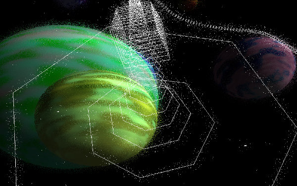

Maths functions
===============

Vectors
-------

Amulet has built-in support for 2, 3 or 4 dimensional vectors.
Vectors are typically used to represent things like position, direction or
velocity in 2 or 3 dimensional space. Representing RGBA colors is another
common use of 4 dimentional vectors.

Each component of a vector is represented internally as a 32 bit float,
so expect some loss of precision when converting between vector components
and Lua numbers (Lua numbers are are typically 64 bit floats).

.. _vec-cons:

Constructing vectors
~~~~~~~~~~~~~~~~~~~~

To construct a vector use one of the functions ``vec2``, ``vec3`` or
``vec4``. A vector may be constructed by passing its components as
separate arguments to one of these functions, for example:

.. code:: lua

    local velocity = vec3(1, 2, 3)

Passing a single number to a vector constructor will set all components
of the vector to that value.

.. code:: lua

    local origin = vec2(0)

It's also possible to construct a vector from a combination of other
vectors and numbers. The new vector's components will be taken from the
other vectors in the order they are passed in.

.. code:: lua

    local bottom_left = vec2(0)
    local top_right = vec2(10, 100)
    local rect = vec4(bottom_left, top_right)
    print(rect)

.. code:

    vec4(0, 0, 10, 100)

Accessing vector components
~~~~~~~~~~~~~~~~~~~~~~~~~~~

There are multiple ways to access the components of a vector. The first
component can be accessed using any of the fields ``x``, ``r`` or ``s``;
the second using any of the fields ``y``, ``g`` or ``t``; the third
using any of the fields ``z``, ``b`` or ``p``; and the fourth using any
of the fields ``w``, ``a`` or ``q``. These fields can be used to
retrieve or set the vector's components.

.. code:: lua

    local color = vec4(0.1, 0.3, 0.7, 0.8)
    print(color.r..", "..color.g..", "..color.b..", "..color.a)
    local point = vec2(0)
    point.x = 5
    point.y = 2
    print("x="..point.x..", y="..point.y)

.. code::

    0.1, 0.3, 0.7, 0.8
    x=5, y=2

A vector's components can also be accessed with 1-based integer indices
and vectors support the Lua length operator (``#``) (this returns the
number of components of the vector, not its magnitude).

.. code:: lua

    local position = vec3(10, 20, 30)
    for i = 1, #position do
        print(position[i])
    end

.. code:

    10
    20
    30

Swizzle fields
~~~~~~~~~~~~~~

Another way to construct vectors is to recombine the components of an
existing vector using *swizzle fields*, which are special fields whose
characters are any of the component field characters. A new vector
containing the named components will be returned.

.. code:: lua

    local dir = vec3(1, 2, 3)
    print(dir.xy)
    print(dir.rggb)
    print(dir.zzys)

.. code:

    vec2(1, 2)
    vec4(1, 2, 2, 3)
    vec4(3, 3, 2, 1)

Swizzle fields can also be used to update multiple components of a
vector using another vector or a single number.

.. code:: lua

    local color = vec3(1, 0.8, 0.5)
    color.rg = color.gr
    print(color)
    color.gb = 0
    print(color)

.. code:

    vec3(0.8, 1, 0.5)
    vec3(0.8, 0, 0)

Vector arithmetic
~~~~~~~~~~~~~~~~~

We can do arithmetic on vectors using the standard operators ``+``,
``-``, ``*`` and ``/``. If both operands are vectors then they should
have the same size and the operation is applied in a component-wise
fashion, yielding a new vector of the same size. If one operand is a
number then the operation is applied to each component of the vector and
the number, yielding a new vector of the same size as the vector
operand.

.. code:: lua

    print(vec2(3, 4) + 1)
    print(vec3(30) / vec3(3, 10, 5))
    print(2 * vec4(1, 2, 3, 4))

.. code:

    vec2(4, 5)
    vec3(10, 3, 6)
    vec4(2, 4, 6, 8)

.. figure:: screenshots/screenshot4.jpg
   :alt: 

Matrices
--------

Amulet has built-in support for 2x2, 3x3 and 4x4 matrices.
Matrices are typically used to represent transformations in 2 or
3 dimensional space such as rotation, scaling, translation or
perspective projection.

.. _mat-cons:

Constructing matrices
~~~~~~~~~~~~~~~~~~~~~

Use one of the functions ``mat2``, ``mat3`` or ``mat4`` to contruct a
2x2, 3x3 or 4x4 matrix.

Passing a single number argument to one of the matrix constructors
generates a matrix with all diagonal elements equal to the number and
all other elements equal to zero. For example ``mat3(1)`` constructs the
3x3 identity matrix:

..  math::

    \begin{bmatrix}
        1 & 0 & 0 \\
        0 & 1 & 0 \\
        0 & 0 & 1
    \end{bmatrix}

We can also pass the individual elements of the matrix as arguments to
one of the constructors. These can either be numbers or vectors or a mix
of the two. As the constructor arguments are consumed from left to
right, the matrix is filled in column by column. This convention is also
used in GLSL. For example:

.. code:: lua

    local m = mat3(1, 2, 3,
                   4, 5, 6,
                   7, 8, 9)

sets ``m`` to the matrix:

..  math::

    \begin{bmatrix}
        1 & 4 & 7 \\
        2 & 5 & 8 \\
        3 & 6 & 9
    \end{bmatrix}

This is admittedly somewhat confusing, because when we write the matrix
constructor in code the columns are layed out horizontally. This is
however the convention used in GLSL and OpenGL and I thought it important to
be consistent with established conventions.

Here's another example:

.. code:: lua

    local m = mat4(vec3(1, 2, 3), 4,
                   vec4(5, 6, 7, 8),
                   vec2(9, 10), vec2(11, 12),
                   13, 14, 15, 16)

This sets ``m`` to the matrix:

..  math::

    \begin{bmatrix}
        1 &  5 &  9 & 13 \\ 
        2 &  6 & 10 & 14 \\ 
        3 &  7 & 11 & 15 \\ 
        4 &  8 & 12 & 16
    \end{bmatrix}

A matrix may also be constructed by passing a matrix of equal or
smaller size to one of the matrix construction functions. The given
matrix is used to fill in the top-left corner of the new matrix and the
rest is filled in with elements from the identity matrix. For example:

.. code:: lua

    local m = mat4(mat2(1, 2, 3, 4))

will set ``m`` to the matrix:

..  math::

    \begin{bmatrix}
        1 & 3 & 0 & 0 \\
        2 & 4 & 0 & 0 \\
        0 & 0 & 1 & 0 \\
        0 & 0 & 0 & 1
    \end{bmatrix}

Finally a 3x3 or 4x4 rotation matrix can be constructed from a quaternion
by passing the quaternion as the single argument to ``mat3`` or ``mat4``
(see :ref:`quaternions`).

Accessing matrix components
~~~~~~~~~~~~~~~~~~~~~~~~~~~

The columns of a matrix can be accessed as vectors using 1-based integer
indices and the Lua length operator returns the number of columns.

.. code:: lua

    local matrix = mat2(1, 0, 0, 2)
    for i = 1, #matrix do
        print(matrix[i])
    end

.. code:

    vec2(1, 0)
    vec2(0, 2)

When accessing a column it is returned as a new vector, so updating a
returned column vector has no effect on the original matrix. This means
that code such as the following has no effect:

.. code:: lua

    local matrix = mat3(1)
    matrix[2][2] = 3 -- THIS DOESN'T WORK!
    print(matrix[2][2])

.. code:

    1

The value at row 2 and column 2 in the matrix will still be 1, because
``matrix[2]`` returns a new vector. Setting the 2nd component of this
new vector to 3 has no effect on the original matrix. Instead if we want
to update an individual element of a matrix, we need to update the
entire column. Like so:

.. code:: lua

    local matrix = mat3(1)
    matrix[2] = vec3(matrix[2][1], 3, matrix[2][3])
    print(matrix[2][2])

.. code:

    3

Matrix arithmetic
~~~~~~~~~~~~~~~~~

As with vectors the ``+``, ``-``, ``*`` and ``/`` operators work with
matrices too. When one operand is a number, the result is a new matrix
of the same size with the operation applied to each element of the
matrix.

.. code:: lua

    print(2 * mat2(1, 2, 3, 4))
    print(mat3(3) - 1)

.. code:

    mat2(2, 4,
         6, 8)
    mat4(2, -1, -1,
        -1,  2, -1,
        -1, -1,  2)

When both operands are matrices, the ``+`` and ``-`` operators work in a
similar way to vectors, with the operations applied component-wise.

.. code:: lua

    print(mat2(1, 2, 3, 4) + mat2(0.1, 0.2, 0.3, 0.4))

.. code:

    mat2(1.1, 2.2,
         3.3, 4.4)

However, when both operands are matrices, the ``*`` operator computes
the `matrix
product <http://en.wikipedia.org/wiki/Matrix_multiplication>`__.

.. code:: lua

    print(mat2(1, 2, 3, 4) * mat2(10, 20, 30, 40))

.. code:

    mat2( 70, 100,
         150, 220)

If the first operand is a vector and the second is a matrix, then the
first operand is taken to be a row vector (a matrix with one row) and
should have the same number of columns as the matrix. The result is the
matrix product of the row vector and the matrix (another row vector).

Similarly if the first argument is a matrix and the second a vector, the
vector is taken to be a column vector (a matrix with one column) and the
result is the matrix product of the matrix and column vector, which is
another column vector.

The ``/`` operator also works, although the second argument should be a
matrix, not a vector. Dividing by a matrix is the same as
multiplying by the inverse of the matrix.

.. figure:: screenshots/screenshot2.jpg
   :alt: 

.. _quaternions:

Quaternions
-----------

Quaternions are useful for representing and manipulating 3D rotations.

.. _quat-cons:

Constructing quaternions
~~~~~~~~~~~~~~~~~~~~~~~~

Use the ``quat`` function to construct a quaternion.

Pass an angle (in radians) and a unit 3D vector to construct
a quaternion that represents a rotation about that axis.
For example:

..  code:: lua

    local q = quat(math.rad(45), vec3(0, 0, 1))

constructs a quaternion that represents a 45 degree
rotation around the z axis. (``math.rad`` converts
radians to degrees).

If the axis argument is omitted then it is taken to be
``vec3(0, 0, 1)``, so the above is equivalent to:

..  code:: lua

    local q = quat(math.rad(45))

This is a useful shortcut for 2D rotations in the xy plane.

A quaternion can also be constructed from euler angles. Euler angles
are rotations around the x, y and z axes, also known as pitch, roll
and yaw. For example:

..  code:: lua

    local q = quat(math.rad(30), math.rad(60), math.rad(20))

constructs a quaternion that represents the rotation you'd end up
with if you first rotated 30 degrees around the x axis, then 60 degrees
around the y axis and finally 20 degrees around the z axis. 

If two unit vector arguments are given, then the quaternion represents
the rotation that would be needed to rotate the one vector into
into the other. For example:

..  code:: lua

    local q = quat(vec3(1, 0, 0), vec3(0, 1, 0))

The above quaternion represents a rotation of 90 degrees in the xy
plane, since it rotates a vector pointing along the x axis to one
pointing along the y axis.

A quaternion can be constructed from a 3x3 or 4x4 matrix by passing
the matrix as the single argument to ``quat``.

A quaternion can also be converted to a 3x3 or 4x4 matrix by passing it
as the single argument to the ``mat3`` or ``mat4`` functions (see :ref:`mat-cons`).

Finally a quaternion can also be contructed from the coefficients
of its real and imaginary parts:

..  code:: lua

    local q = quat(w, x, y, z)

w is the real part and x, y and z are the coeffients of the 
imaginary parts i, j and k.

Quaternion fields
~~~~~~~~~~~~~~~~~

Quaternion operations
~~~~~~~~~~~~~~~~~~~~~

Math function reference
-----------------------

Vector functions
~~~~~~~~~~~~~~~~

..  function:: vec2(...)

    Constructs a 2 dimensional vector. See :ref:`vec-cons` for more details.

..  function:: vec3(...)

    Constructs a 3 dimensional vector. See :ref:`vec-cons` for more details.

..  function:: vec4(...)

    Constructs a 4 dimensional vector. See :ref:`vec-cons` for more details.

..  function:: math.dot(vector1, vector2)

    Returns the dot product of two vectors. The vectors must have the same
    size.

..  function:: math.cross(vector1, vector2)

    Returns the cross product of two 3 dimensional vectors.

..  function:: math.normalize(vector)

    Returns the normalized form of a vector (i.e. the vector that points
    in the same direction, but whose length is 1). If the given vector has
    zero length, then a vector of the same size is returned whose first
    component is 1 and whose remaining components are 0.

..  function:: math.length(vector)

    Returns the length of a vector.

..  function:: math.distance(vector1, vector2)

    Returns the distance between two vectors.

Matrix functions
~~~~~~~~~~~~~~~~

..  function:: mat2(...)

    Constructs a 2x2 matrix. See :ref:`mat-cons` for more details.

..  function:: mat3(...)

    Constructs a 3x3 matrix. See :ref:`mat-cons` for more details.

..  function:: mat4(...)

    Constructs a 4x4 matrix. See :ref:`mat-cons` for more details.

..  function:: math.inverse(matrix)

    Returns the inverse of a matrix.

..  function:: math.lookat(eye, center, up)

    Creates a 4x4 view matrix at ``eye``, looking in the direction of
    ``center`` with the y axis of the camera pointing in the direction same
    direction as ``up``.

..  function:: math.perspective(fovy, aspect, near, far)

    Creates a 4x4 matrix for a symetric perspective-view frustum.

    -  ``fovy`` is the field of view in the y plain, in radians.
    -  ``aspect`` is typically the window width divided by its height.
    -  ``near`` and ``far`` are the distances of the near and far clipping plains from the camera (these should be positive).

Quaternion functions
~~~~~~~~~~~~~~~~~~~~

Noise functions
~~~~~~~~~~~~~~~

Interpolation functions
~~~~~~~~~~~~~~~~~~~~~~~
